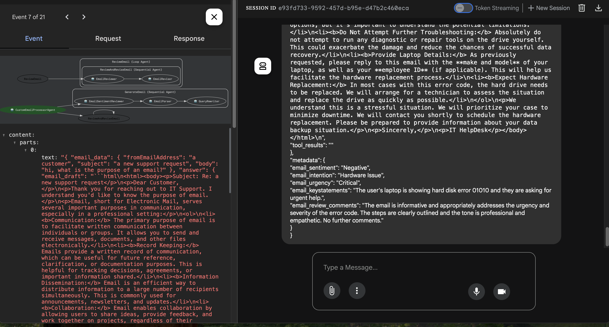
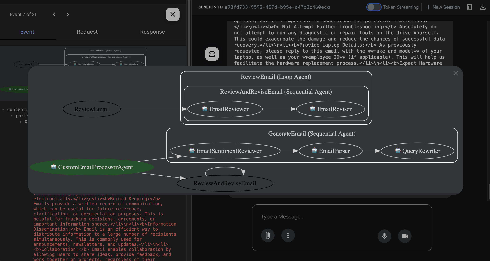

# Email Processing Sample

This sample code demonstrates how to use the Agentic Development Kit (ADK) to process emails using Google Cloud Platform (GCP) services. The code includes functionalities for reading, processing, and responding to emails using AI agents.

## Prerequisites

- Python 3.8 or higher
- GCP account with necessary permissions
- Google Cloud SDK installed and configured
- An email service (e.g., Gmail) with API access enabled
- A GCP API key (see https://aistudio.google.com/apikey to generate one for your project)

## Setup and Test Agent

To setup and test the agent, you can do the following.

This will allow the agent to run as a simple invocable script and not use a REST API to drive it.

```bash
    rm -r .venv
    python3 -m venv .venv
    source .venv/bin/activate
    pip install -r requirements.txt
    export GOOGLE_API_KEY=<YourKey>

    python3 -m adk.agent
    Properties loaded successfully.
    {
      "email_data": {
        "fromEmailAddress": "johndoe@example.com",
        "subject": "Urgent: My laptop is not turning on",
        "body": "Hi, my laptop is not turning on. I've tried charging it and pressing the power button multiple times."
      },
      "answer": {
        "email_draft": "```html\n<html><body>\n<p>Subject: Re: Urgent: My laptop is not turning on</p>\n\n<p>Dear John Doe,</p>\n\n<p>I understand your laptop is not turning on, even after charging and pressing the power button. I'll do my best to assist you with this urgent issue.</p>\n\n<p>Here are a few things we can check:</p>\n\n<ol>\n  <li><b>Confirm the Charger is Working:</b> Although you've tried charging it, please ensure the charger itself is functional. Try a different outlet or, if possible, test the charger with another compatible device.</li>\n  <li><b>Check the Battery:</b> If your laptop has a removable battery, try removing it, holding the power button for 30 seconds, then reinserting the battery and trying to power it on. If it's not removable, skip this step.</li>\n  <li><b>Inspect the Power Cord and Adapter:</b> Look for any physical damage like fraying, cuts, or bent pins. A damaged cord may not be delivering power.</li>\n  <li><b>Listen for any Sounds:</b> When you press the power button, do you hear any fans spinning, beeps, or other noises? This can help indicate if the laptop is getting some power and attempting to start.</li>\n  <li><b>External Display Test:</b> Connect your laptop to an external monitor. If you see a display on the external monitor, the issue may be with your laptop's screen rather than the power system.</li>\n</ol>\n\n<p>To help me further diagnose the problem and escalate it to the appropriate team if necessary, please provide the following information:</p>\n\n<ul>\n  <li><b>Laptop Model:</b> Please provide the exact model number of your laptop (e.g., Dell XPS 15, Lenovo ThinkPad T480). This helps us find specific troubleshooting steps for your device.</li>\n  <li><b>Operating System:</b> What operating system are you using (e.g. Windows 10, Windows 11)?</li>\n  <li><b>Recent Events:</b> Were there any recent events that might be related, such as a power surge, liquid spill, or physical damage?</li>\n  <li><b>Any Indicator Lights?:</b> Are any indicator lights on, blinking, or off when you plug in the charger and press the power button? Please describe which lights you see and their status.</li>\n</ul>\n\n<p>Once I have this information, I can provide more specific troubleshooting steps or escalate the issue to our hardware support team. If the issue is hardware related, we will need to process a hardware repair request.</p>\n\n<p>Thank you for your patience.</p>\n\n<p>Sincerely,<br/>\nHelpBot | IT Support</p>\n</body></html>\n```",
        "tool_results": ""
      },
      "metadata": {
        "email_sentiment": "Negative",
        "email_intention": "Hardware Issue",
        "email_urgency": "High",
        "email_keystatements": "The user's laptop is not turning on despite attempting to charge it and press the power button, requiring hardware support.",
        "email_review_comments": "No further comments."
      }
    }
    python3 -m adk.agent \
        "Hi, My laptop is making clunking noises when I boot it up and it then starts to whine. I think the fan or HD has a problem. How should I proceed? This is urgent. Thanks, Jim"
    Properties loaded successfully.
    {
      "email_data": {
        "fromEmailAddress": "a customer",
        "subject": "a new support request",
        "body": "Hi, My laptop is making clunking noises when I boot it up and it then starts to whine. I think the fan or HD has a problem. How should I proceed? This is urgent. Thanks, Jim"
      },
      "answer": {
        "email_draft": "```html\n<html><body>\n<p>Subject: Re: a new support request</p>\n\n<p>Dear Jim,</p>\n\n<p>Thank you for reaching out to IT Support. I understand your laptop is making unusual noises, and this is causing you concern. I will do my best to guide you.</p>\n\n<p>The noises you describe (clunking and whining) may indicate a hardware issue, most likely with the hard drive or the cooling fan. Given the urgency you've expressed, I recommend the following steps:</p>\n\n<ol>\n  <li><b>Do Not Delay:</b> Continuing to use the laptop in its current state could potentially cause further damage and data loss, especially if the hard drive is failing.</li>\n  <li><b>Backup Important Data:</b> If the laptop is still somewhat functional, immediately back up any critical data to an external drive, cloud storage, or network location. This is your top priority. If you are unable to back data up yourself, please follow the escalation steps below.</li>\n  <li><b>Check for Obvious Obstructions:</b> Power off the device. Unplug it. Check the fan vents for any physical obstructions like dust or debris. Use compressed air to gently clean the vents.</li>\n  <li><b>Listen Carefully:</b> If possible, try to isolate the source of the noise. Is it coming from the hard drive area or the fan area? This can help us diagnose the issue more accurately.</li>\n  <li><b>Run Diagnostics (If Possible):</b> Most laptops have built-in diagnostic tools. Consult your laptop's manual or the manufacturer's website for instructions on how to run a hardware diagnostic test. This may provide error codes that can help pinpoint the problem.</li>\n</ol>\n\n<p><b>Escalation:</b></p>\n\n<p>Given the potential for data loss and hardware failure, I recommend escalating this issue to on-site support as soon as possible. Please reply to this email with the following information so we can dispatch a technician:</p>\n\n<ol>\n    <li><b>Your Location:</b> Building and floor number.</li>\n    <li><b>Asset Tag:</b> The laptop's asset tag number (usually found on a sticker on the bottom of the laptop).</li>\n    <li><b>Operating System:</b> Specify if you are running Windows, Linux or macOS.</li>\n    <li><b>Backup Status:</b> Confirm whether or not you were able to back up your data.</li>\n</ol>\n\n<p>In the meantime, please do not attempt any repairs yourself, as this could void your warranty or cause further damage.</p>\n\n<p>We will do our best to resolve this issue quickly. </p>\n\n<p>Sincerely,<br/>\nIT HelpBot</p>\n</body></html>\n```",
        "tool_results": ""
      },
      "metadata": {
        "email_sentiment": "Negative",
        "email_intention": "Hardware Issue",
        "email_urgency": "High",
        "email_keystatements": "The user's laptop is making noises and they suspect a hardware problem. They are asking for advice on how to proceed urgently.",
        "email_review_comments": "The email is well-written and informative. To improve it, consider adding a direct sentence reassuring Jim that on-site support will be dispatched quickly once the requested information is received, reinforcing the urgency of the situation.\nNo further comments."
      }
    }

```

## Test Deployment Emulation

To check that the agent is working correctly in the GCP ADK environment, you can use the web service.

```bash
    .venv/bin/python -m pip install --force-reinstall --no-cache-dir google-adk
    .venv/bin/adk web
```

Sample runs in ADK


Sample flow



## Deploy to GCP

To deploy to GCP, you will need to do the following.

```bash
    cd ..
    rm -fr EmailProcessing/.venv/
    local gsName="$(echo gs://adk-email-processing-$(gcloud config get-value project)-$(date +%Y%m%d-%H%M%S))"
    gcloud auth application-default login
    gcloud storage buckets create ${gsName}
    export PROJECT_ID=$(gcloud config get-value project)
    adk deploy agent_engine EmailProcessing/ \
        --project=$(gcloud config get-value project) \
        --region=us-central1 \
        --staging_bucket="${gsName}" \
        --display_name="email_processing"
```

## Building Docker Image for Cloud Deployment

To build the docker image, you will need to do the following.

```bash
    docker build . -t adkagent
```

To run the docker image locally, you will need to do the following.

````bash
    gcloud auth application-default login
    docker run --rm -it -v ~/.config/gcloud:/root/.config/gcloud \
        -e PROJECT_ID=<projectId> \
        -e GOOGLE_API_KEY=<apiKey> \
        -e AGENTSPACE_AI_URL=https://<region>>-discoveryengine.googleapis.com/v1alpha/projects/<projectId>/locations/<region>/collections/default_collection/engines/<agentspaceAgent>/servingConfigs/default_search:search \
        -e GOOGLE_GENAI_USE_VERTEXAI=false \
        -p 8080:8080 \
        adkagent
    curl http://localhost:8080/query \
        -H "Content-Type: application/json" \
        -d '{
                "query": {
                    "fromEmailAddress": "johndoe@example.com",
                    "subject": "Policy query",
                    "body": "Hi, I am from HR and I need to know about the policy for hiring new recruits, thanks."
                }
            }'
        {
            "response": {
                "answer": {
                "email_draft": "```html\n<html>\n<body>\n<p>Dear John Doe,</p>\n\n<p>Thank you for reaching out to us. I understand you're looking for information regarding our company's hiring policies for new recruits.</p>\n\n<p>Our policy is to be an **equal opportunity employer**. We do not unlawfully discriminate against employees or applicants based on race, color, religion, creed, sex, national origin, age, disability, marital status, veteran status, or any other status protected by applicable law. This applies to all aspects of employment, including recruitment, hiring, placement, compensation, promotion, discipline, and termination.</p>\n\n<p>We are committed to providing reasonable accommodations for qualified individuals with disabilities, as required by law. If an employee needs a reasonable accommodation, they should contact [enter authorized person\u2019s name].</p>\n\n<p>We also strictly prohibit discrimination or harassment based on any protected characteristic. We aim to create a professional environment that promotes equal employment opportunities and is free from discriminatory practices.</p>\n\n<p>For more detailed information, please refer to the **Employee Handbook**, which outlines our policies and procedures in detail. It is located [state location of handbook, e.g., on the company intranet under HR Resources].</p>\n\n<p>I hope this addresses your query. If you need further clarification or have more specific questions, please do not hesitate to ask.</p>\n\n<p>Best regards,</p>\n<p>HelpBot</p>\n<p>IT Support</p>\n</body>\n</html>\n```",
                "tool_results": "This company is an equal opportunity employer and does not unlawfully discriminate against employees or applicants for employment based on an individual’s race, color, religion, creed, sex, national origin, age, disability, marital status, veteran status, or any other status protected by applicable law. This policy applies to all terms, conditions, and privileges of employment, including recruitment, hiring, placement, compensation, promotion, discipline, and termination. The company makes reasonable accommodations for qualified individuals with disabilities to the extent required by law whenever possible. Employees who wish to request a reasonable accommodation should contact [enter authorized person’s name].\n\nThe company prohibits discrimination or harassment based on race, color, religion, creed, sex, national origin, age, disability, marital status, veteran status, or any other status protected by applicable law. Every individual has the right to work in a professional atmosphere that promotes equal employment opportunities and is free from discriminatory practices, including harassment. Discrimination includes, but is not limited to, making any employment decision or employment-related action based on race, color, religion, creed, age, sex, disability, national origin, marital or veteran status, or any other status protected by applicable law. Harassment is generally defined as unwelcome verbal or non-verbal conduct, based upon a person’s protected characteristic, that denigrates or shows hostility or aversion toward the person because of the characteristic, and which affects the person’s employment opportunities or benefits, has the purpose or effect of unreasonably interfering with the person’s work performance, or has the purpose or effect of creating an intimidating, hostile or offensive working environment. Harassing conduct includes, but is not limited to, epithets and slurs. Violations of this policy will not be tolerated.\n\nAn employee handbook's purpose is to orient new employees with the company and provide answers to frequently asked employee questions. It informs new employees about company policy, emphasizes the at-will nature of employment, and outlines the company’s disciplinary and termination rights. Most importantly, it is a declaration of the employer’s rights and expectations. To prepare a handbook, companies should review their policies, decide which are fundamental, which need adjustment, and which should be removed. This model handbook is intended to help in that review process and may include policies that a company does not have. For example, if a company does not offer health insurance, it would not include a section on health insurance or COBRA.\n\nAt a minimum, an employee handbook should contain:\n* An employment at-will disclaimer (section 1.3).\n* A statement regarding equal employment opportunity (section 2.1).\n* A policy prohibiting unlawful discrimination and harassment (section 2.2).\n* A section describing the policy for use of company property, social media, and privacy rules (section 3).\n* A section on employment classification and overtime rules (section 4).\n* A policy on Family and Medical Leave if the company has 50 or more employees (section 6.3).\n* A section on Safety (section 9).\nCompanies should also consider including a disciplinary guideline (section 8).\n\nThis handbook has been prepared to inform new employees of the company’s policies and procedures and to establish the company’s expectations. It is not all-inclusive or intended to provide strict interpretations of policies; rather, it offers an overview of the work environment. This handbook is not a contract, expressed or implied, guaranteeing employment for any length of time, and is not intended to induce an employee to accept employment with the company. The company reserves the right to unilaterally revise, suspend, revoke, terminate, or change any of its policies, in whole or in part, whether described within this handbook or elsewhere, in its sole discretion. If any discrepancy between this handbook and current company policy arises, current company policy should be conformed to. Every effort will be made to keep employees informed of the company’s policies, however, notice of revisions cannot be guaranteed. Employees are encouraged to ask questions about any information within this handbook. This handbook supersedes and replaces any and all personnel policies and manuals previously distributed, made available, or applicable to employees.\n\nEmployment at this company is at-will. An at-will employment relationship can be terminated at any time, with or without reason or notice by either the employer or the employee. The at-will employment status of each employee cannot be altered by any verbal statement or alleged verbal agreement of company personnel. It can only be changed by a legally binding, written contract covering employment status, such as a written employment agreement for a specific duration of time. Sections 1.2 and 1.3 are essential items for a handbook. Employers are vulnerable to lawsuits if they do not provide statements regarding the non-contractual nature of the handbook or at-will employment. Some states limit the terms of at-will employment or have additional requirements for effectively disclaiming the existence of a contract (e.g., requiring that the disclaimer be conspicuous by underlining it or placing it in bold text). The National Labor Relations Board (NLRB) has recently questioned the legality of at-will employment disclaimers in employee handbooks, arguing that such provisions may restrict an employee’s Section 7 rights under the National Labor Relations Act. Specifically, the NLRB contends that typical at-will disclaimers may lead employees to conclude that they cannot alter their employment relationship, even through collective bargaining. Therefore, it is advisable to consult with an employment attorney regarding state laws and federal issues.\n\nCompanies should include an equal opportunity statement and a disability statement to demonstrate observance of relevant laws. Companies should also be aware of state and/or local laws that provide greater protection than federal discrimination laws, such as recognizing additional protected classes beyond those protected by federal statute. The Americans with Disabilities Act requires employers to provide reasonable accommodations to qualified individuals with disabilities unless doing so would cause an undue hardship to the company."
                },
                "email_data": {
                "body": "{\"fromEmailAddress\": \"johndoe@example.com\", \"subject\": \"Policy query\", \"body\": \"Hi, I am from HR and I need to know about the policy for hiring new recruits, thanks.\", \"dateTime\": null}",
                "fromEmailAddress": "a customer",
                "subject": "a new support request"
                },
                "metadata": {
                "email_intention": "Policy Question",
                "email_review_comments": "The email is well-written and informative, but replacing \"[enter authorized person’s name]\" with an actual name would improve its clarity and demonstrate attention to detail; also, specifying the exact location of the Employee Handbook, rather than providing an example, would make it even more helpful.\nNo further comments.",
                "email_sentiment": "Neutral",
                "email_urgency": "Normal"
                }
            }
        }
````

To deploy to CloudRun, you will need to run the following.

Create an environment file in `/tmp/file.txt`

Populate this file with the variables you need.

```bash
    PROJECT_ID:<projectId>
    GOOGLE_API_KEY:<apiKey>
    AGENTSPACE_AI_URL:https://<region>>-discoveryengine.googleapis.com/v1alpha/projects/<projectId>/locations/<region>/collections/default_collection/engines/<agentspaceAgent>/servingConfigs/default_search:search
    GOOGLE_GENAI_USE_VERTEXAI:false
```

Then run the below command

```bash
    gcloud run deploy emailprocessor \
        --source . \
        --region us-central1 \
        --platform managed \
        --description "CloudRun for Comms Assist" \
        --allow-unauthenticated \
        --execution-environment gen2 \
        --ingress all \
        --port 8080 \
        --env-vars-file=/tmp/file.txt
```

## Notes

- For notes on ADK agents - see https://google.github.io/adk-docs/agents/
