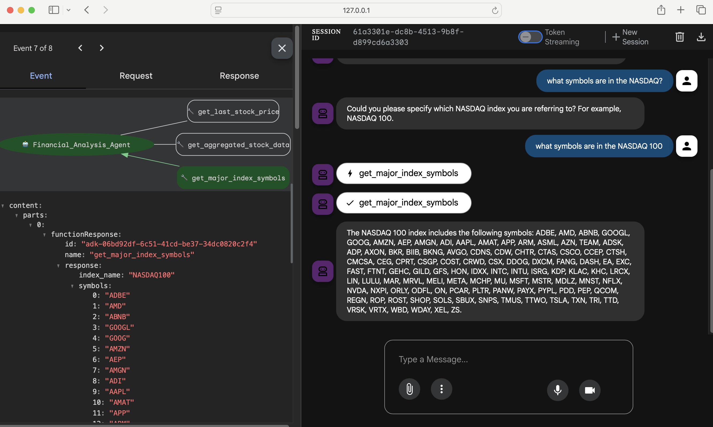
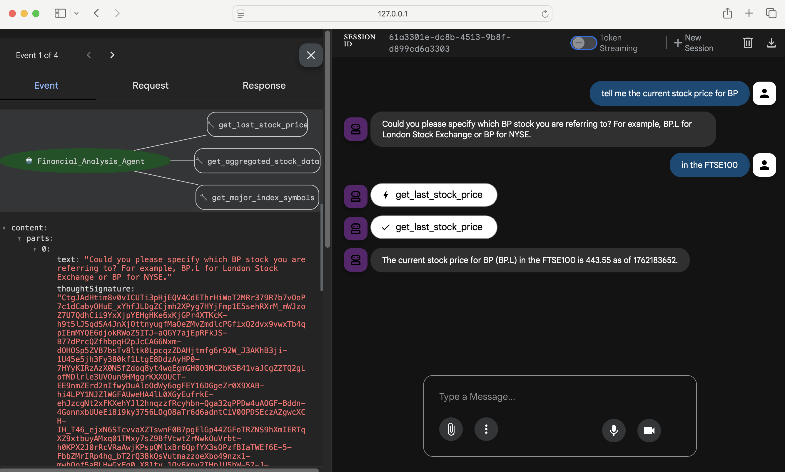
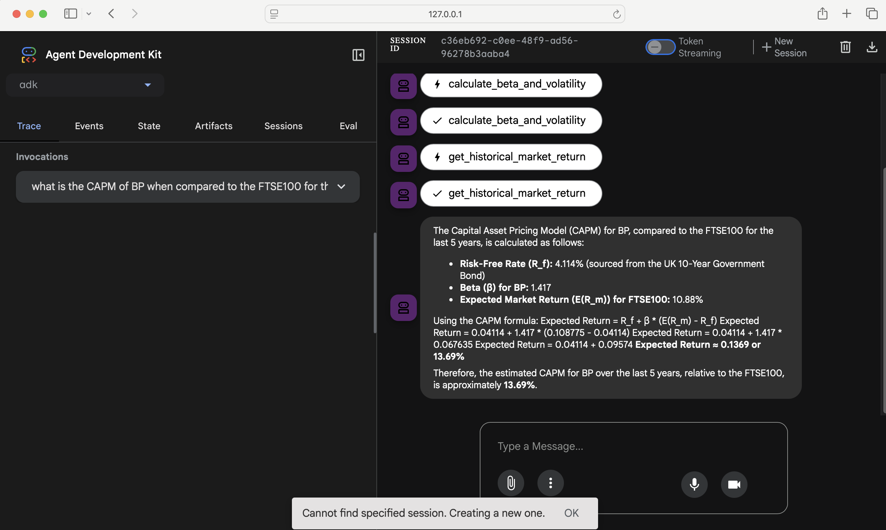
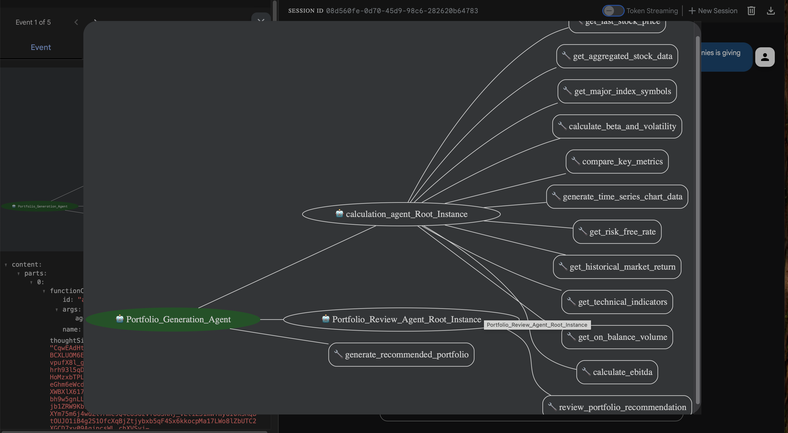
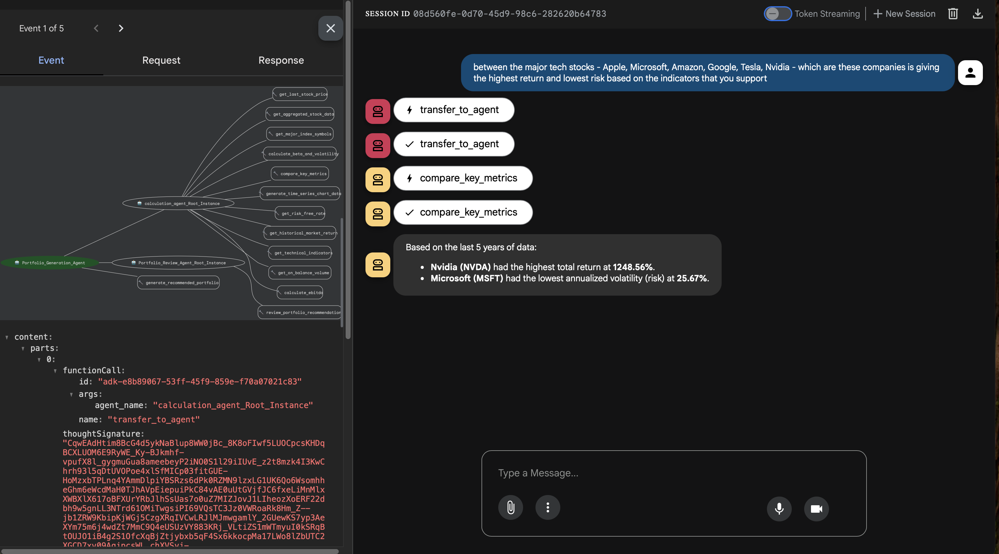

# ADK Yahoo Finance LLM Agent

A lightweight ADK LLM agent exposing Yahoo Finance tools via a root LLM agent.

## Features

- **Tools:**  
    - `get_last_stock_price`  
    - `get_aggregated_stock_data`  
    - `get_major_index_symbols`
    - `calculate_beta_and_volatility`
    - `compare_key_metrics`
    - `generate_time_series_chart_data`
    - `get_risk_free_rate`
    - `get_historical_market_return`   
    *(yfinance-backed)*

- Root `LlmAgent` accepts natural-language queries, parses LLM-style JSON decisions, and invokes tools.
- In-memory requests-cache to avoid filesystem permission issues in containers.

---

## Repository Layout

```
├── Dockerfile
├── finance_agents
│   ├── __init__.py
│   ├── agent.py
│   ├── calculation_agent.py
│   └── review_agent.py
├── Images
│   ├── sample001.png
│   ├── sample002.png
│   └── sample003.png
├── README.md
└── requirements.txt
```

---

## Requirements

Minimal Python packages required by the agent:

- yfinance
- requests-cache
- pandas
- numpy
- lxml

See `requirements.txt` for version constraints used in your environment.

---

## Setup and Test Agent

To setup and test the agent, you can do the following.

This will allow the agent to run as a simple invocable script and not use a REST API to drive it.

```bash
    rm -r .venv
    python3 -m venv .venv
    source .venv/bin/activate
    pip install -r requirements.txt
    export GOOGLE_API_KEY=<YourKey>
```

## Test Deployment Emulation

To check that the agent is working correctly in the GCP ADK environment, you can use the web service.

```bash
    .venv/bin/python -m pip install --force-reinstall --no-cache-dir google-adk
    .venv/bin/adk web
```

Sample runs in ADK


Sample flow


Sample CAPM flow calculation


Sample Stock Recommendation




---

## Docker Usage

**Build:**

```bash
docker build . -t adkfinance
```

**Interactive run:**

```bash
docker run --rm -it adkfinance
```


**Notes:**

- The Docker image runs the module `finance_agents.agent` as the container ENTRYPOINT. Arguments passed to `docker run` are forwarded to the module.

---

## Financial Analytical Methods for Stock Analysis

The financial analytical methods used fall into two main categories: 
**Technical Indicators** (used for market timing and trend analysis) and 
**Risk & Return Models** (used for valuation and risk assessment).

| Method | Category | Description | How to Use (Enrichment) |
| :--- | :--- | :--- | :--- |
| **Simple Moving Average (SMA)** | Technical | A straightforward average of a security's price over a specified number of periods (e.g., the 20-day SMA). It smooths out price fluctuations to show the underlying trend. | Use it to **identify the trend direction** and **dynamic support/resistance levels**. When the price is consistently above the SMA, the trend is bullish; when below, it's bearish. |
| **Relative Strength Index (RSI)** | Technical | A momentum oscillator that measures the speed and change of price movements, calculated on a scale of 0 to 100. | Use it to **identify overbought or oversold conditions**. A reading **above 70** suggests the asset is overbought and may be due for a pullback, while a reading **below 30** suggests it is oversold and may be due for a bounce. |
| **Moving Average Convergence Divergence (MACD)** | Technical | A trend-following momentum indicator that shows the relationship between two exponential moving averages (EMAs) of a security's price. It includes a MACD Line, a Signal Line, and a Histogram. | Use it to **gauge momentum and generate trade signals**. A **positive MACD Histogram** (where the MACD Line is above the Signal Line) suggests upward momentum and a potential buy signal. |
| **On-Balance Volume (OBV)** | Technical | A cumulative volume-based indicator that links volume to price change. It adds volume on up days and subtracts volume on down days. | Use it to **confirm the conviction behind a price trend**. If price rises but **OBV falls**, it suggests a weak move or lack of institutional buyer participation, indicating the price trend may be unreliable or temporary. |
| **Capital Asset Pricing Model (CAPM)** | Risk & Return | A model used to determine the theoretically **required rate of return** for an asset, given its risk relative to the overall market. It is calculated as: $E(R_i) = R_f + \beta_i * (E(R_m) - R_f)$. | Use it to **evaluate if a stock is fairly priced**. If the stock's expected return is **higher** than the CAPM-calculated required return, the stock might be undervalued. |
| **Beta ($\beta$)** | Risk & Return | A measure of the **systematic risk** of a stock—how much the stock's price moves in relation to the overall market (e.g., the FTSE 100). | Use it to **measure sensitivity and risk**. A Beta **greater than 1** means the stock is theoretically more volatile (higher systematic risk) than the market, while a Beta **less than 1** means it is less volatile. |
| **Sharpe Ratio** | Risk & Return | Measures the **excess return** (annualized return minus risk-free rate) per unit of **total risk** (annualized volatility/standard deviation). | Use it to **compare risk-adjusted returns**. A **higher** Sharpe Ratio indicates better performance for the amount of risk taken. |
| **Sortino Ratio** | Risk & Return | Similar to Sharpe, but only penalizes returns for **downside volatility** (risk of negative returns relative to a minimum acceptable return, often the risk-free rate). | Use it to **assess risk-adjusted returns** for risk-averse investors. A **higher** ratio is better, as it ignores "good" volatility from upward movements. |
| **Treynor Ratio** | Risk & Return | Measures the **excess return** (annualized return minus risk-free rate) per unit of **systematic risk** ($\beta$). | Use it to **assess portfolio performance** when the portfolio is a component of a larger, well-diversified portfolio. A **higher** ratio is better. |
| **Jensen's Alpha** | Risk & Return | Measures the **excess return** of an investment compared to its theoretically expected return as predicted by the CAPM. | Use it to **evaluate management skill**. A **positive** Alpha indicates the asset has outperformed the market expectation for its level of risk. |
| **Piotroski F-Score** | Fundamental | A discrete score (0–9) based on nine fundamental criteria related to profitability, leverage/liquidity, and operating efficiency. | Use it to **identify fundamentally strong stocks** (scores 7-9) and avoid weaker ones (scores 0-2). High scores suggest improving financial health. |
| **PEG Ratio** | Fundamental | Price-to-Earnings (P/E) Ratio divided by the annual Earnings Per Share (EPS) growth rate. | Use it to **determine if a stock is fairly valued** based on its expected growth. A PEG Ratio **near or below 1.0** is generally considered favorable. |

---

## Sample Prompts

- "Between the major tech stocks - Apple, Microsoft, Amazon, Google, Tesla, Nvidia - which of these companies is giving the highest return and lowest risk based on the indicators that you support"
- "Calculate the Jensen's Alpha for NVIDIA (NVDA). Assume its actual annualized return is 65%, its Beta is 1.5, the market return is 10%, and the risk-free rate is 4.5%."
- "Calculate the OBV for JPMorgan Chase (JPM) for the 1-year period."
- "Calculate the Price-to-Earnings Ratio for Microsoft (MSFT) and what is its Sharpe Ratio over the last 5 years, assuming a risk-free rate of 4.5%."
- "Calculate the Sortino Ratio for Tesla (TSLA) over the last 3 years using an annual risk-free rate of 4.2%."
- "Calculate the Treynor Ratio for Google (GOOGL), assuming its annualized return is 22% and its Beta is 1.05, using a risk-free rate of 4.0%."
- "Can you provide the latest 20-day Simple Moving Average (SMA) for the FTSE 100 (^FTSE) over the past year?"
- "Get the stock price for BP from FTSE100"
- "I need the complete technical indicator data, including the MACD, RSI, and SMA, for Microsoft (MSFT) for the 3-month period."
- "Please check the On-Balance Volume for Alphabet (GOOGL) over the past 3 months."
- "What are the RSI and MACD values for Tesla (TSLA) based on the last 6 months of data?"
- "What is the CAPM of CTSH when compared to the FTSE100 for the last 5 years"
- "What is the PEG Ratio for Netflix (NFLX)?"
- "What is the Piotroski F-Score for Exxon Mobil (XOM)?"
- "What is the correlation matrix for the daily returns of Microsoft (MSFT), Exxon Mobil (XOM), and Visa (V) over the past 5 years?"
- "What is the current On-Balance Volume (OBV) reading for Amazon (AMZN) using the last 2 years of trading data?"

--- 

## Issues to keep in mind

- If you are using the free tier of Gemini to run this app, i.e. the `GOOGLE_API_KEY`, then you may well run into resource limits if you attempt to generate a "real" portfolio of 10+ stocks etc. Other operations requiring many tokens may also hit similar limits.
- As this sample code is presented for demo purposes only, NO WARRANTY OR OTHER GUARANTEES OF FUNCATIONALITY ARE PROVIDED. See [LICENSE](https://github.com/tpayne/agentic-ai-adk/blob/main/LICENSE) for more details.
