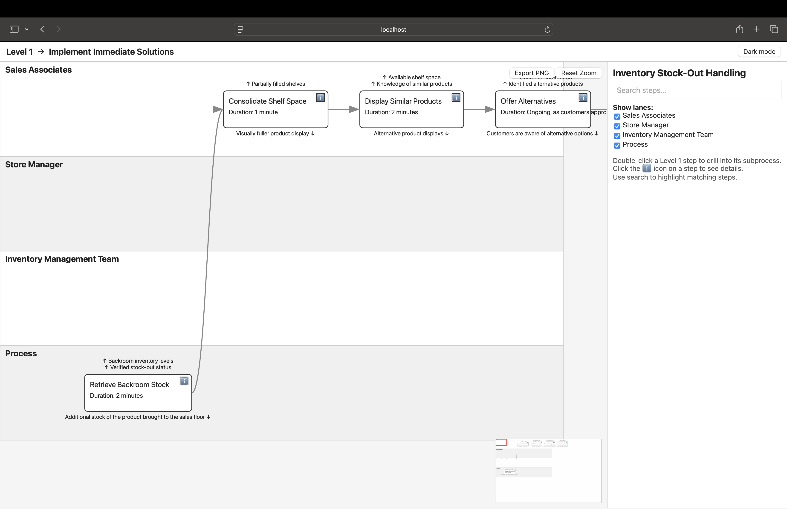
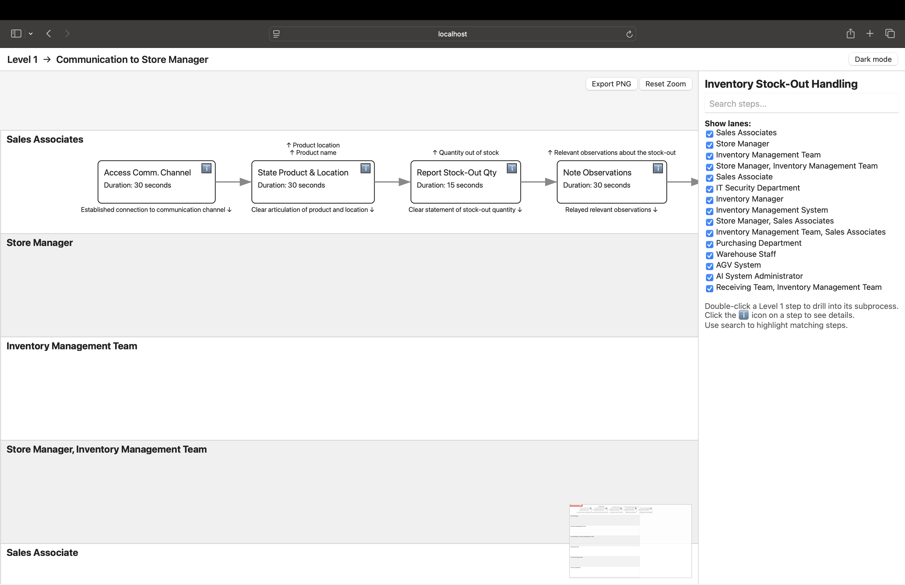
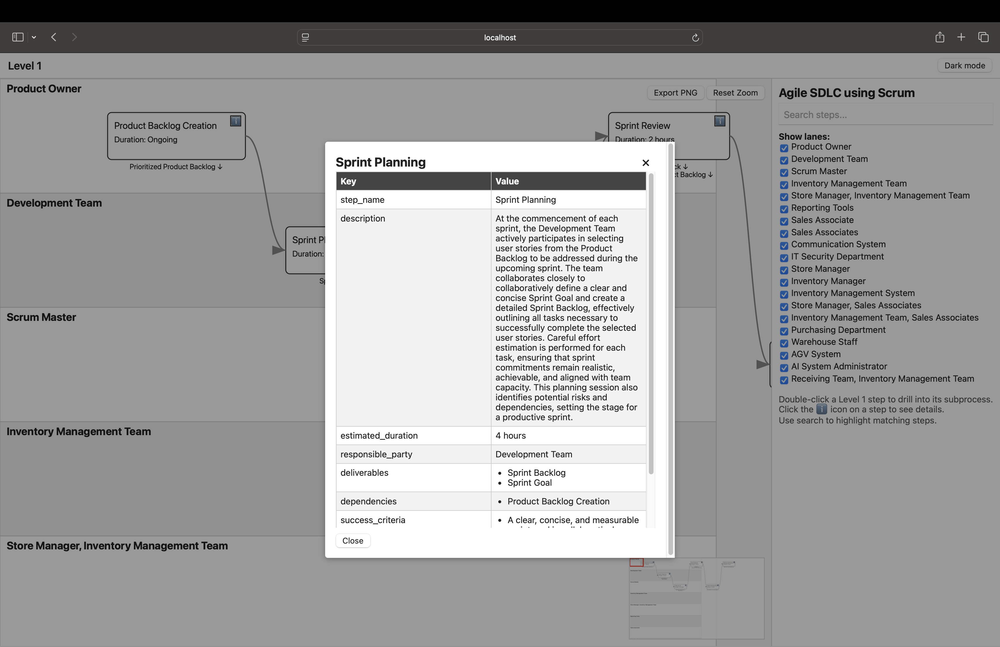
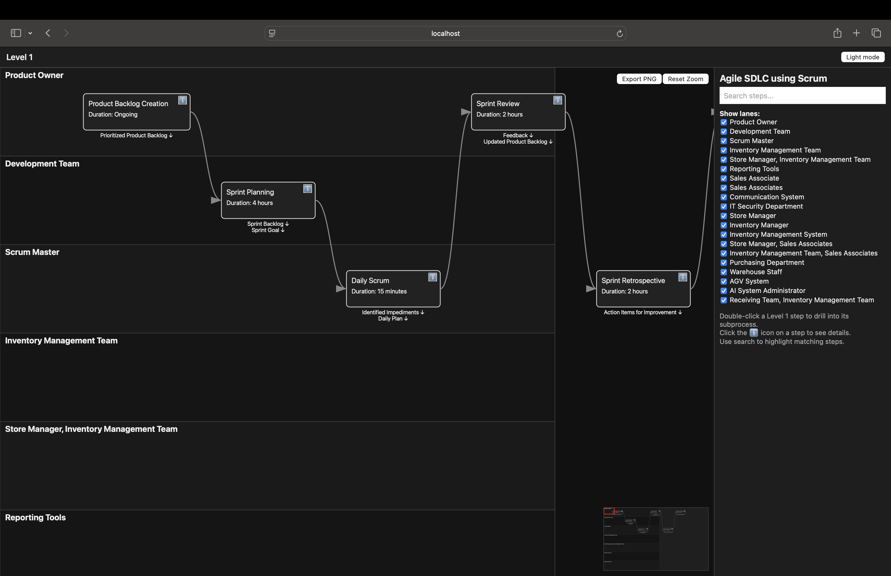

# ADK Business Process Architect

This sample hosts a specialized multi-agent suite built on the Google Agent Development Kit (ADK). The system automates the lifecycle of business process engineering from initial requirements through to generating professional process documentation and validated workflows.

Basically, this agent will take a raw prompt and design, test, and document a full end-to-end process based on that business process request.

In other words, this agent is used for automated process engineering - going from very rough requirements through to tested documentation. A handy tool for consultants.

--- 

## Status

This sample has been tested and is generally stable; however, it may occasionally produce overly verbose chat outputs.

Treat this ADK sample as a BETA. While current Large Language Models (LLMs) are increasingly reliable, you should always verify the tool's output to ensure it meets your specific requirements and remains stable.

---

## Known issues

The following are a list of known issues: -
- Diagram Layouts: Generated diagrams may occasionally be clipped or laid out sub-optimally. You can often improve the visualization by modifying the process JSON and regenerating the diagram.
- Agent "Chattiness": While agents are instructed to remain quiet, LLMs may occasionally disregard these constraints and output unnecessary JSON or tooling commentary. In most cases, these outputs can be safely ignored.

---

## Notes

- Treat this ADK sample as a BETA. Large language models can produce unpredictable results.
- The sample code could be refined. Some safeguards and helper functions can be optimized, removed, or reduced.
- This agent is only able to create processes and cannot hold general conversations or modify processes based on queries or test proposed process flows based on user input. If I have the time or need, I might add this functionality in the future. **This functionality is now mostly implemented, but not completely**
- If you are generating a new process from scratch, then it would be best to remove the `output/` sub-directory as it may contain old process files. 
- However, if you are looking to modify or query an existing process, then you MUST leave the `output/` sub-directory alone as this is used as input for the process queries and reviews. If you delete the directory is this case, then there will be no process definitions to read.
- Sometimes the root agent gets confused as to which agent to use to address a query. If you get this, you can change to prompt to something like **"using the Consulting Agent...."** and it will use the right one. Agents available are: -
    * Consulting Agent for general queries
    * Simulation Agent for running simulations
    * Scenario Testing Agent for running "what if" type queries

---

## ⚙️ Features

The ADK pipeline provides:

- **Autonomous Multi-Agent Pipeline**: A high-velocity "Process Architect" workflow that transforms raw requirements into final artifacts without manual intervention. The Analysis Agent converts natur[...]
- **Zero-Loss Data Normalization**: A JSON Normalizer Agent sanitizes and stabilizes free-form design outputs to a fixed, enriched document schema.
- **Self-Auditing Compliance Gate**: A Compliance Agent acts as an automated release manager, triggering recursive revisions if regulatory or security gaps are found and preventing progression until r[...]
- **Self-Auditing Simulation Gate**: A Simulation Agent runs Monte Carlo-style simulations to identify bottlenecks and suggests optimizations or reports unresolved issues.
- **Automated High-Fidelity Artifacts**:
  - Process diagrams (level 1 and 2) embedded in the process document.
  - A professional Word document describing the business process and related information, aligned to ITIL and ISO-style conventions.

---

### 🚀 Autonomous Execution Flow

1. **Requirement Extraction**: The Analysis Agent converts user intent into a machine-readable JSON Requirements Specification.
2. **Iterative Refinement**: Design and Compliance agents loop, refining the process until operational and regulatory criteria are satisfied. This cycle includes testing and optimization.
3. **Schema Stabilization**: The Normalizer Agent maps the finalized design to a stable documentation contract and saves the state to `process_data.json`.
4. **Artifact Engineering**: The Documentation Agent renders diagrams and generates the final specification (Word document) from the local state.

---

## 🏗️ Repository Layout

```
.
├── Dockerfile
├── examples
│   ├── DataCentreMigration
│   │   ├── data_centre_migration_with_progress_tracking_and_escalation_flow.png
│   │   ├── Data_Centre_Migration_with_Progress_Tracking_and_Escalation.docx
│   │   └── process_data.json
│   └── EnergyProvider
│       ├── Business_Customer_Incident_Management.docx
│       └── process_data.json
├── process_agents
│   ├── __init__.py
│   ├── agent.py
│   ├── analysis_agent.py
│   ├── compliance_agent.py
│   ├── design_agent.py
│   ├── doc_generation_agent.py
│   ├── edge_inference_agent.py
│   ├── json_normalizer_agent.py
│   ├── json_review_agent.py
│   ├── json_writer_agent.py
│   ├── simulation_agent.py
│   ├── step_diagram_agent.py
│   ├── subprocess_driver_agent.py
│   ├── subprocess_generator_agent.py
│   └── subprocess_writer_agent.py
├── README.md
└── requirements.txt
```

---

## 🛠 Requirements

- **Google API Key**: An active Gemini API key (set as `GOOGLE_API_KEY` in your environment).
- **Python 3.12+**.
- **Dependencies**: See `requirements.txt`. Note: some packages (e.g., graphviz, python-docx) may require system packages (graphviz binary, LibreOffice for advanced doc conversions, etc.) — document[...]

---

## Setup and Run Locally

Suggested local setup (non-destructive):

```bash
# create a venv (do not delete an existing venv unless you mean to)
rm -fr .venv
python3 -m venv .venv
source .venv/bin/activate
pip install -r requirements.txt

# set your API key (consider using a .env or secrets manager in production)
export GOOGLE_API_KEY="<YourKey>"

# run the pipeline
.venv/bin/adk run process_agents
```

Notes:
- Avoid running `rm -r .venv` unless you are sure you want to remove the virtual environment.
- Consider storing secrets in a secure location or using a .env file and a tool like direnv.

## Test Deployment Emulation using WebUI

To run the web UI locally (emulates the GCP ADK environment):

```bash
.venv/bin/python -m pip install --force-reinstall --no-cache-dir google-adk
.venv/bin/adk web
```

---

## Docker Usage

Build:

```bash
docker build . -t adkprocesseng
```

Interactive run (persist output to local output/ directory):

```bash
docker run -it --rm \
  -v "$(pwd)/output:/app/output" \
  -e GOOGLE_API_KEY="${GOOGLE_API_KEY}" \
  adkprocesseng:latest
```

Notes:
- The ADK CLI is installed during container startup and used via `adk run`.
- Ensure your host `output` folder is writable by the container user.

---

## Sample Prompts

The following are sample prompts you can use to...
- Creating new processes
- Update existing processes
- Investigate existing processes
- Reviewing "what-if" scenarios on existing processes
- Running simualtions on process flows to detect issues, bottlenecks or optimisation issues

### Creating Processes
- "Create an Enterprise Architecture and Business Enterprise Architecture SDLC process to track EA decisions, outcomes, and progress, with escalation flows."
- "Design a detailed business process for handling inventory stock-outs in a retail environment."
- "Create an SDLC and release process for a WebDev application with microservices using an Agile Scrum base."
- "Please create me a data governance and management process strategy for managing corporate data that will be used in AI strategies"
- "Please compose an HR process that utilizes generative artificial intelligence (GenAI) to augment tasks such as curriculum vitae (CV) review, job specification creation, employee reviews, employee grievance processes and ALL other standard HR process. Implement robust safeguards to ensure that human intervention is utilized when necessary, and prevent GenAI from adversely affecting processes or reputation by being excessively employed in areas where human expertise is required. Additionally, ensure that all training data or AI-generated results adhere to privacy and ethical usage regulations."
- "Please create me an SDLC process for developing products at the Enterprise/Program-level using the latest Agile SAFe framework. I want the process to include - Program level management, release train management, ERM program release planning, big room planning, deployment management of releases, processes for handling dependencies be groups, configuration management procedures, processes for interacting with the System Team and anything else I might have missed that is relevant to SAFe."
- "Act as COO/Architect. Design a SaaS L0 Value Chain with 6 phases: 1. Strategic Management, 2. Product Strategy, 3. Go-To-Market, 4. SDLC, 5. Customer Success, 6. Corporate Functions (HR/Finance/Security). For each phase, provide: Professional description paragraph, Primary Stakeholders, Inputs/Outputs (artifacts), and 3-5 Sub-processes. Flow: Strategy -> Product -> Engineering -> Sales. Ensure active voice and format for mapping to JSON keys: process_name, stakeholders, process_steps, and process_owner."
- "You are a god. you want to create a world in 1 month and you need to put together a detailed process on how you are going to create that world, with its natural processes, ecosystems and balanced life forms. Ensure the process descriptions are detailed and cover the main activities that you need to do in other to create a via and self-sustaining world. The ultimate goal you have is at the end of the month you have a world which will work without you monitoring it and which will ultimately give rise to intelligent life."

### Reviewing or Querying Existing Processes
- "Tell me what happens when a security audit is triggered?"
- "What roles are needed for a sprint planning session?"
- "Who is responsible for the escalation process being closed?"
- "Describe the overall process flow"
- "Using the Consulting Agent, review the process and let me know of any issues areas relative to SAFe 4.0 standards."

### Running What-If Scenarios on Existing Processes
- "What would happen if a security audit failed?"
- "What would be the impact on a delivery if releases did not happen on time?"
- "I need to look at the security reviews on the process - where do they need to be added?"

### Applying Updates to Existing Processes & Regenerating the Documentation
- "Update the process to add security reviews at key stages"
- "Add a code review process to the development steps"
- "Modify the process to add test quality review steps prior to releases being done"

### Running Simulations
- "Dry-run the process and identify any issues"

---

## Running the document generator manually

To run the document generator manually, you must: -
1. Ensure `process_data.json` is present in the `output/` directory.
2. Run the following code snippet:

```python
python -m process_agents.edge_inference_agent output/process_data.json 
python -m process_agents.doc_generation_agent output/process_data.json
```

This will regenerate the documents without deleting any process files.

---

## Tuning Instructions

To modify the instructions used for the LLMs, see the `instructions` directory and
edit the relevant `.txt` file as appropriate.

---

## Process Viewer

I added a *simple* process viewer for the process JSON. You can invoke it using...

```bash
python -m process_agents.app
open localhost:8080
```

This will launch a simple web server that will let you view the JSON process flow in a browser.












---

## Contributing

Thank you for your interest in improving this sample! To make contributing simple and consistent, please follow these guidelines.

Please see [CONTRIBUTORS.md](CONTRIBUTORS.md) for more info as the following is just a summary.

- Setup
  - Fork the repository and work on a feature branch named with a clear prefix, e.g. `feat/`, `fix/`, `docs/`, `chore/` (example: `feat/process-diagram-layout`).
- Code style
  - Follow PEP 8 and general Python best practices.
  - If you use automatic formatting, prefer tools like `black` and `isort`.
  - Run linters (e.g., `flake8`) if present in your workflow.
- Tests
  - Add or update tests for your changes where appropriate. Run tests with `pytest` (or the test runner used in this repo).
  - Verify that any automated checks (CI) pass before requesting review.
- Documentation
  - Update relevant README files, examples, and instruction text for changes that affect usage or setup.
  - If you change behavior or add new sample outputs, include updated example files under `examples/` where appropriate.
- Commit messages
  - Use clear, descriptive commit messages. Consider using the Conventional Commits format: `type(scope): short description` (e.g., `fix(doc): clarify setup instructions`).
- Pull requests
  - Open a pull request against the `main` branch.
  - In the PR description include: a summary of the change, why it’s needed, any migration or compatibility notes, and links to related issues.
  - Mark the PR as draft if it’s a work-in-progress.
  - Request a review from the maintainers and respond to requested changes.
- Small edits
  - For small typos or docs-only fixes you may use the GitHub web UI to edit a file and propose a PR directly from the browser.
- Licensing and contribution terms
  - By submitting a PR you agree that your contribution will be licensed under this repository’s license (see the LICENSE file).
  - If a Contributor License Agreement (CLA) or other process is required later, maintainers will add instructions.
- CI and checks
  - Ensure all CI checks pass; maintainers may require changes or additional tests if checks fail.
- Need help?
  - Open an issue describing the change you want to make or tag maintainers in the PR for guidance. For larger changes, early discussion via an issue saves time.

We appreciate contributions of any size — thanks for helping improve this sample.

---

## Known issues and caveats

- If you use a free tier Gemini key you may encounter resource limits when generating large artifacts or portfolios.
- This sample is for demo purposes only; NO WARRANTY OR GUARANTEE OF FUNCTIONALITY IS PROVIDED. See [LICENSE](https://github.com/tpayne/agentic-ai-adk/blob/main/LICENSE).
- Always validate the generated process for compliance before production use. You can modify the JSON directly and re-run the local pipeline.
- The exit/loop logic may need tuning — sometimes loops do not exit properly which can consume tokens.
- If the LLM fails to call a tool, rephrase the prompt or rerun the process. Document generation (diagramming and Word export) can be run manually if needed.
- The diagrams generated can sometimes be clipped or overlapped. To fix this you might need to modify the process or step process JSON to reduce the size of the labels or instruct the LLMs to make the step names more concise.

---
