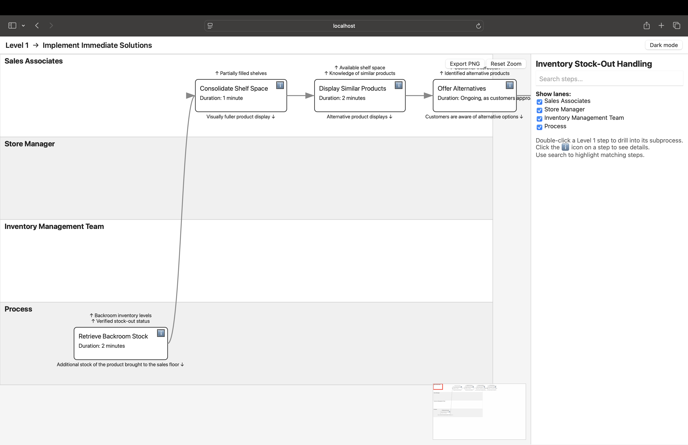
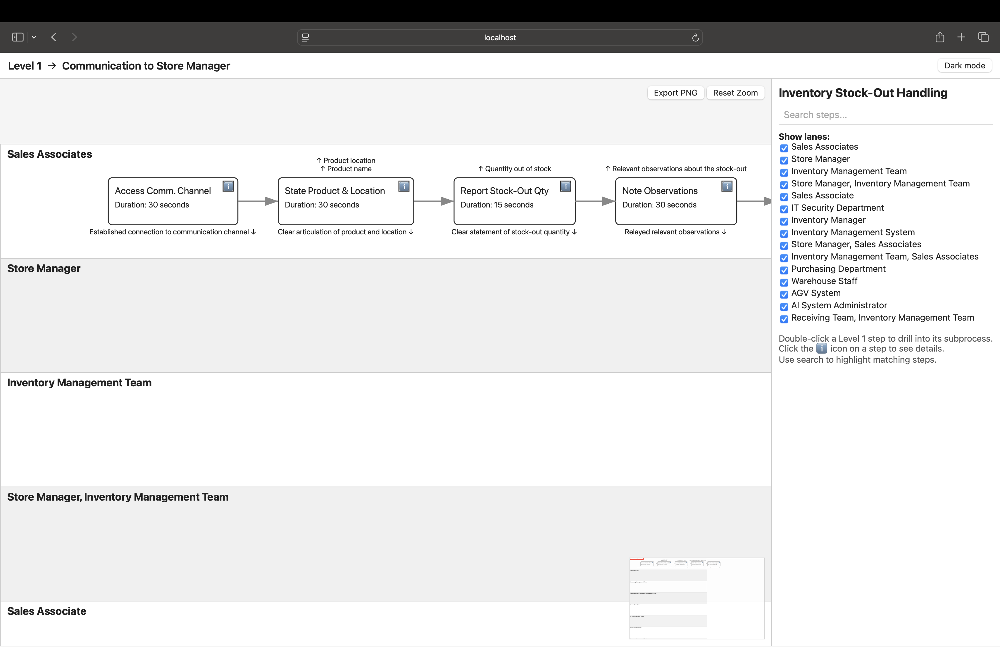
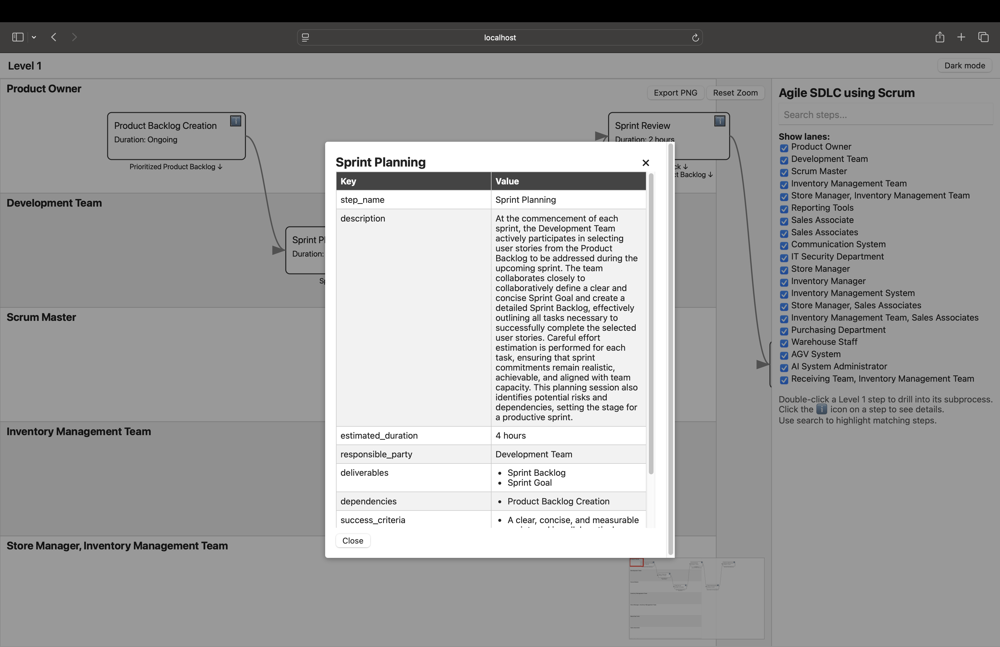
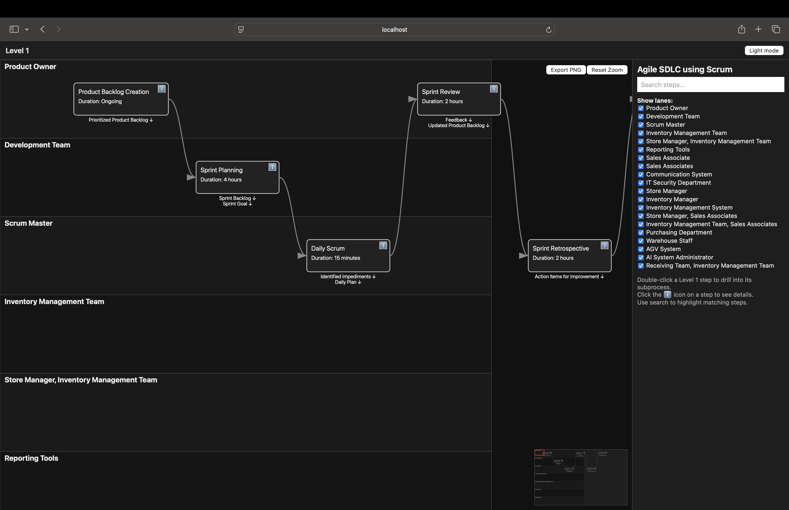
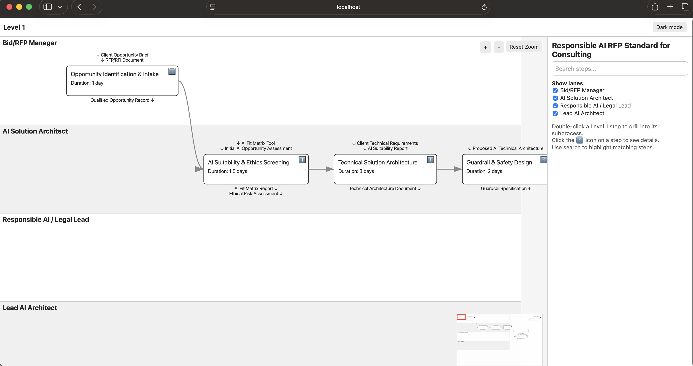
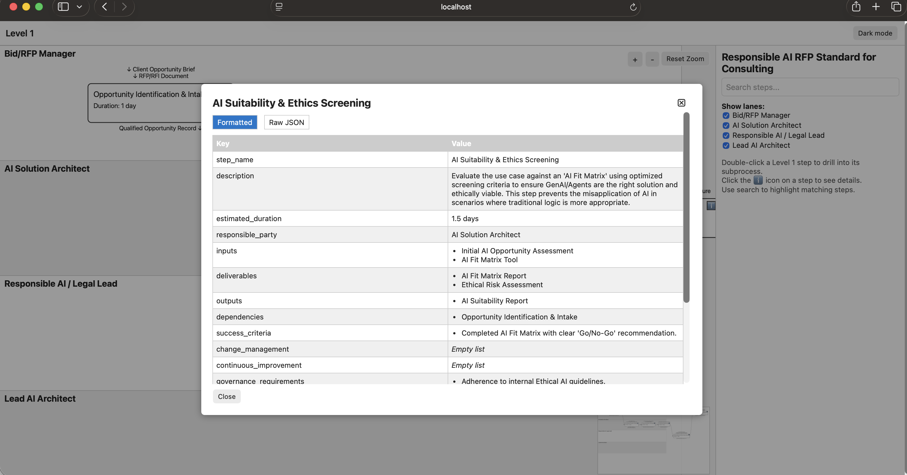

# ADK Business Process Architect

This sample hosts a specialized multi-agent suite built on the Google Agent Development Kit (ADK). The system automates the lifecycle of business process engineering from initial requirements through to generating professional process documentation and validated workflows. It also supports an equivalent lifecycle for architectural design documentation (High-Level Design, Low-Level Design, or Combined), covering the same create/query/what-if/simulate/update pattern.

Basically, this agent will take a raw prompt and design, test, and document a full end-to-end process (or a full architectural design document) based on that request.

In other words, this agent is used for automated process engineering and automated solution/architecture documentation - going from very rough requirements through to tested documentation. A handy tool for consultants and architects alike.

This application is based on Google ADK but is using `LiteLlm`, so you can use multiple model providers. To use different models, set the appropriate model in the `agentapp.properties` file. 

--- 

## Status

This sample has been tested and is generally stable; however, it may occasionally produce overly verbose chat outputs.

Treat this ADK sample as a BETA. While current Large Language Models (LLMs) are increasingly reliable, you should always verify the tool's output to ensure it meets your specific requirements and remains stable.

---

## Known issues

The following are a list of known issues: -
- Diagram Layouts: Generated diagrams may occasionally be clipped or laid out sub-optimally. You can often improve the visualization by modifying the process JSON and regenerating the diagram.
- Agent "Chattiness": While agents are instructed to remain quiet, LLMs may occasionally disregard these constraints and output unnecessary JSON or tooling commentary. In most cases, these outputs can be safely ignored.

---

## Notes

- Treat this ADK sample as a BETA. Large language models can produce unpredictable results.
- The sample code could be refined. Some safeguards and helper functions can be optimized, removed, or reduced.
- This agent is only able to create processes and cannot hold general conversations or modify processes based on queries or test proposed process flows based on user input. If I have the time or need, I might add this functionality in the future. **This functionality is now mostly implemented, but not completely**
- If you are generating a new process from scratch, then it would be best to remove the `output/` sub-directory as it may contain old process files. 
- However, if you are looking to modify or query an existing process, then you MUST leave the `output/` sub-directory alone as this is used as input for the process queries and reviews. If you delete the directory is this case, then there will be no process definitions to read.
- The same applies to design documents: if generating a new HLD/LLD/Combined design from scratch, clear out any old `design_data.json` from `output/`; if you are querying, testing, or updating an existing design document, leave `output/` alone as it is used as input for the design queries, scenario tests, and simulations.
- Sometimes the root agent gets confused as to which agent to use to address a query. If you get this, you can change the prompt to something like **"using the Consulting Agent...."** and it will use the right one. Agents available are: -
    * Consulting Agent for general queries about an existing **process**
    * Simulation Agent for running simulations on a **process**
    * Scenario Testing Agent for running "what if" type queries against a **process**
    * Design Consultant Agent for general queries about an existing **design document** (HLD/LLD/Combined)
    * Design Architecture Simulation Query Agent for running resilience, scalability, security, and latency simulations against a **design document**
    * Design Scenario Tester for running "what if" type queries against a **design document**
    * CloudArch Pipeline for generating or regenerating cloud architecture diagrams from a **design document**
  If the root agent picks the wrong domain (e.g. it treats a design-document question as a process question, or vice-versa), naming the agent explicitly in your prompt (e.g. **"using the Design Consultant Agent..."**) will steer it correctly.

---

## ⚙️ Features

The ADK pipeline provides:

- **Autonomous Multi-Agent Pipeline**: A high-velocity "Process Architect" workflow that transforms raw requirements into final artifacts without manual intervention. The Analysis Agent converts natur[...]
- **Zero-Loss Data Normalization**: A JSON Normalizer Agent sanitizes and stabilizes free-form design outputs to a fixed, enriched document schema.
- **Self-Auditing Compliance Gate**: A Compliance Agent acts as an automated release manager, triggering recursive revisions if regulatory or security gaps are found and preventing progression until r[...]
- **Self-Auditing Simulation Gate**: A Simulation Agent runs Monte Carlo-style simulations to identify bottlenecks and suggests optimizations or reports unresolved issues.
- **Automated High-Fidelity Artifacts**:
  - Process diagrams (level 1 and 2) embedded in the process document.
  - A professional Word document describing the business process and related information, aligned to ITIL and ISO-style conventions.
- **Autonomous Design Document Pipeline**: A parallel "Solution Architect" workflow (`Full_Design_Doc_Pipeline` / `Update_Design_Doc_Pipeline`) that transforms raw architecture requirements into a High-Level Design (HLD), Low-Level Design (LLD), or Combined design document, following the same requirements → design → review → normalize → document flow as the process pipeline.
- **Self-Auditing Design Review Loop**: A design-side review/compliance loop iterates over the HLD/LLD/Combined document, checking it against `design_document_schema.json` and standards references (e.g. TOGAF ADM, C4 Model, ISO/IEC/IEEE 42010) until it is structurally and content-complete.
- **Self-Auditing Design Simulation Gate**: A `Design_Architecture_Simulation_Agent` runs the same four-dimension simulation (below) as an internal gate inside `Full_Design_Doc_Pipeline`/`Update_Design_Doc_Pipeline`, triggering revisions if resilience, scalability, security, or latency issues are found — the design-side equivalent of the process pipeline's Self-Auditing Simulation Gate.
- **Cloud Architecture Diagramming (`CloudArch_Pipeline`)**: A dedicated reviewer/generator loop (`cloudarch_agent`, `cloudarch_reviewer_agent`) produces and iteratively refines a cloud/UML-style architecture diagram from the design document's components, dependencies, and integration points.
- **Real LLD Sequence Diagrams**: Each Low-Level Design component's `sequence_flows` entries carry their own inline participants and ordered steps (`design_document_schema.json`'s `sequenceDiagramSpec`), rendered as an actual UML-style sequence diagram (lifelines, sync/async calls, returns) and embedded in the generated document — not a placeholder reference to a diagram that was never produced.
- **Four-Dimension Design Simulation**: A `Design_Architecture_Simulation_Query_Agent` runs a single composite simulation over an existing design document covering:
  - **Resilience** — a Monte Carlo blast-radius/cascading-failure model built from component dependencies, integration points, declared availability targets, and risk register entries, identifying single points of failure and an overall resilience risk rating.
  - **Scalability** — structural bottleneck detection (components many others depend on with no declared elastic/auto-scaling technology), plus any scalability-tagged risks.
  - **Security** — a control-coverage checklist, compliance-standard status tally, security-tagged risks, and an externally-exposed-without-full-controls check.
  - **Latency** — declared performance/latency targets cross-checked against the deepest dependency chain in the architecture, flagging undeclared latency budgets on long request paths.
- **Design Consultant & Scenario Testing**: A `Design_Consultant_Agent` answers general questions about an existing design document (ownership, component responsibilities, requirements clarification), while a `Design_Scenario_Tester` reasons through "what-if" scenarios (e.g. "what if the payments region goes down?") by tracing impact through the dependency and integration-point graph — handing off to the simulation agent for any quantitative estimate.

---

### 🚀 Autonomous Execution Flow

1. **Requirement Extraction**: The Analysis Agent converts user intent into a machine-readable JSON Requirements Specification.
2. **Iterative Refinement**: Design and Compliance agents loop, refining the process until operational and regulatory criteria are satisfied. This cycle includes testing and optimization.
3. **Schema Stabilization**: The Normalizer Agent maps the finalized design to a stable documentation contract and saves the state to `process_data.json`.
4. **Artifact Engineering**: The Documentation Agent renders diagrams and generates the final specification (Word document) from the local state.

---

### 🚀 Autonomous Design Document Execution Flow

1. **Requirement Extraction**: The Design Analysis Agent converts user intent (target architecture, constraints, quality attributes) into a machine-readable design requirements specification, and determines whether an HLD, LLD, or Combined document is being requested.
2. **Iterative Refinement**: Design and review agents loop over the HLD/LLD/Combined content — components, dependencies, integration points, risk register, security architecture, scalability/performance targets — until the document is structurally complete against `design_document_schema.json`.
3. **Schema Stabilization**: The design-side Normalizer Agent maps the finalized design to the stable `design_document_schema.json` contract and saves the state to `output/design_data.json`.
4. **Cloud Architecture Diagramming**: The `CloudArch_Pipeline` reviewer/generator loop renders a cloud/UML-style architecture diagram from the components, dependencies, and integration points in the finalized design.
5. **Artifact Engineering**: The Documentation Agent renders the final design specification (Word document) from the local `design_data.json` state, alongside the generated architecture diagram.

Once a design document exists on disk, it can be queried (`Design_Consultant_Agent`), tested against what-if scenarios (`Design_Scenario_Tester`), simulated across resilience/scalability/security/latency (`Design_Architecture_Simulation_Query_Agent`), or updated and re-documented (`Update_Design_Doc_Pipeline`) — mirroring the equivalent process-side capabilities above.

---

## 🏗️ Repository Layout

```
.
├── CODE_OF_CONDUCT.md
├── CONTRIBUTORS.md
├── Dockerfile
├── examples
│   ├── AgileSAFE
│   │   ├── iteration_feedback.json
│   │   ├── process_data.json
│   │   ├── safe_sdlc_process_flow.png
│   │   ├── SAFe_SDLC_Process.docx
│   │   ├── simulation_results.json
│   │   ├── step_diagrams
│   │   │   ├── Innovation_and_Planning_(IP)_Iteration.png
│   │   │   ├── Inspect_and_Adapt.png
│   │   │   ├── Iteration_Execution.png
│   │   │   ├── PI_Planning.png
│   │   │   ├── Pre-PI_Planning.png
│   │   │   ├── Release.png
│   │   │   └── System_Demos.png
│   │   └── subprocesses
│   │       ├── Innovation_and_Planning_(IP)_Iteration.json
│   │       ├── Inspect_and_Adapt.json
│   │       ├── Iteration_Execution.json
│   │       ├── PI_Planning.json
│   │       ├── Pre-PI_Planning.json
│   │       ├── Release.json
│   │       └── System_Demos.json
│   ├── AgileSCRUM
│   │   ├── agile_sdlc_using_scrum_flow.png
│   │   ├── Agile_SDLC_using_Scrum.docx
│   │   ├── process_data.json
│   │   ├── process_flow.png
│   │   ├── simulation_results.json
│   │   ├── step_diagrams
│   │   │   ├── Backlog_Refinement.png
│   │   │   ├── Daily_Scrum.png
│   │   │   ├── Product_Backlog_Creation.png
│   │   │   ├── Sprint_Planning.png
│   │   │   ├── Sprint_Retrospective.png
│   │   │   └── Sprint_Review.png
│   │   └── subprocesses
│   │       ├── Backlog_Refinement.json
│   │       ├── Daily_Scrum.json
│   │       ├── Product_Backlog_Creation.json
│   │       ├── Sprint_Planning.json
│   │       ├── Sprint_Retrospective.json
│   │       └── Sprint_Review.json
│   ├── DataCentreMigration
│   │   ├── data_centre_migration_with_progress_tracking_and_escalation_flow.png
│   │   ├── Data_Centre_Migration_with_Progress_Tracking_and_Escalation.docx
│   │   └── process_data.json
│   ├── DataGovern
│   │   ├── data_governance_and_management_process_for_ai_flow.png
│   │   ├── Data_Governance_and_Management_Process_for_AI.docx
│   │   ├── iteration_feedback.json
│   │   ├── process_data.json
│   │   ├── simulation_results.json
│   │   ├── step_diagrams
│   │   │   ├── Define_Data_Governance_Policies.png
│   │   │   ├── Enforce_Security_Protocols.png
│   │   │   ├── Identify_Data_Owners.png
│   │   │   ├── Implement_Data_Quality_Checks.png
│   │   │   └── Monitor_Data_Usage.png
│   │   └── subprocesses
│   │       ├── Define_Data_Governance_Policies.json
│   │       ├── Enforce_Security_Protocols.json
│   │       ├── Identify_Data_Owners.json
│   │       ├── Implement_Data_Quality_Checks.json
│   │       └── Monitor_Data_Usage.json
│   ├── EnergyProvider
│   │   ├── Business_Customer_Incident_Management.docx
│   │   └── process_data.json
│   ├── GodRole
│   │   ├── iteration_feedback.json
│   │   ├── process_data.json
│   │   ├── simulation_results.json
│   │   ├── step_diagrams
│   │   │   ├── Atmospheric_and_Hydrological_Development.png
│   │   │   ├── Autonomous_Operation.png
│   │   │   ├── Biodiversity_Expansion.png
│   │   │   ├── Conceptualization_and_Planning.png
│   │   │   ├── Ecosystem_Creation.png
│   │   │   ├── Geological_Formation.png
│   │   │   ├── Intelligent_Life_Development.png
│   │   │   └── World_Stabilization.png
│   │   ├── subprocesses
│   │   │   ├── Atmospheric_and_Hydrological_Development.json
│   │   │   ├── Autonomous_Operation.json
│   │   │   ├── Biodiversity_Expansion.json
│   │   │   ├── Conceptualization_and_Planning.json
│   │   │   ├── Ecosystem_Creation.json
│   │   │   ├── Geological_Formation.json
│   │   │   ├── Intelligent_Life_Development.json
│   │   │   └── World_Stabilization.json
│   │   ├── world_creation_flow.png
│   │   └── World_Creation.docx
│   ├── HRAI
│   │   ├── genai_augmented_hr_process_flow.png
│   │   ├── GenAI_Augmented_HR_Process.docx
│   │   ├── iteration_feedback.json
│   │   ├── process_data.json
│   │   ├── simulation_results.json
│   │   ├── step_diagrams
│   │   │   ├── CV_Review.png
│   │   │   ├── Employee_Grievances.png
│   │   │   ├── Employee_Reviews.png
│   │   │   ├── HR_Reporting.png
│   │   │   ├── Job_Specification_Creation.png
│   │   │   ├── Onboarding.png
│   │   │   └── Training_and_Development.png
│   │   └── subprocesses
│   │       ├── CV_Review.json
│   │       ├── Employee_Grievances.json
│   │       ├── Employee_Reviews.json
│   │       ├── HR_Reporting.json
│   │       ├── Job_Specification_Creation.json
│   │       ├── Onboarding.json
│   │       └── Training_and_Development.json
│   ├── LiveRuns
│   │   ├── sample_consultSimulation_agents.md
│   │   └── sample_pharma_queries.md
│   ├── PharmaDrugDev
│   │   ├── drug_development_value_chain_flow.png
│   │   ├── Drug_Development_Value_Chain.docx
│   │   ├── iteration_feedback.json
│   │   ├── process_data.json
│   │   ├── simulation_results.json
│   │   ├── step_diagrams
│   │   │   ├── Clinical_Development.png
│   │   │   ├── Commercialization.png
│   │   │   ├── Discovery_and_Pre-Clinical.png
│   │   │   ├── Manufacturing.png
│   │   │   └── Regulatory_Approval.png
│   │   └── subprocesses
│   │       ├── Clinical_Development.json
│   │       ├── Commercialization.json
│   │       ├── Discovery_and_Pre-Clinical.json
│   │       ├── Manufacturing.json
│   │       └── Regulatory_Approval.json
│   ├── SaaS
│   │   ├── iteration_feedback.json
│   │   ├── process_data.json
│   │   ├── saas_l0_value_chain_flow.png
│   │   ├── SaaS_L0_Value_Chain.docx
│   │   ├── simulation_results.json
│   │   ├── step_diagrams
│   │   │   ├── Corporate_Functions.png
│   │   │   ├── Customer_Success.png
│   │   │   ├── Go-To-Market.png
│   │   │   ├── Product_Strategy.png
│   │   │   ├── SDLC.png
│   │   │   └── Strategic_Management.png
│   │   └── subprocesses
│   │       ├── Corporate_Functions.json
│   │       ├── Customer_Success.json
│   │       ├── Go-To-Market.json
│   │       ├── Product_Strategy.json
│   │       ├── SDLC.json
│   │       └── Strategic_Management.json
│   ├── StockInventory
│   │   ├── inventory_stock-out_handling_process_flow.png
│   │   ├── Inventory_Stock-out_Handling_Process.docx
│   │   ├── process_data.json
│   │   ├── simulation_results.json
│   │   ├── step_diagrams
│   │   │   ├── Immediate_Action.png
│   │   │   ├── Inventory_Replenishment.png
│   │   │   ├── Order_Fulfillment.png
│   │   │   ├── Order_Placement.png
│   │   │   ├── Preventive_Measures.png
│   │   │   ├── Root_Cause_Analysis.png
│   │   │   ├── Stock-out_Identification.png
│   │   │   └── Verification_and_Documentation.png
│   │   └── subprocesses
│   │       ├── Backorder_Management.json
│   │       ├── Data_Security_Audit.json
│   │       ├── Emergency_Order__if_necessary_.json
│   │       ├── Immediate_Action.json
│   │       ├── Inventory_Replenishment.json
│   │       ├── Order_Fulfillment.json
│   │       ├── Order_Placement.json
│   │       ├── Preventive_Measures.json
│   │       ├── Restocking.json
│   │       ├── Review_and_Prevention.json
│   │       ├── Root_Cause_Analysis.json
│   │       ├── Stock-out_Identification.json
│   │       └── Verification_and_Documentation.json
│   └── TOGAF
│       ├── approval.json
│       ├── iteration_feedback.json
│       ├── logs
│       │   ├── pipeline_20260209_212641.log
│       │   ├── runtime_errors.log
│       │   └── runtime_outputs.log
│       ├── process_data.json
│       ├── simulation_results.json
│       ├── step_diagrams
│       │   ├── 1._Architecture_Vision.png
│       │   ├── 2._Business_Architecture.png
│       │   ├── 3._Information_Systems_Architecture.png
│       │   ├── 4._Technology_Architecture.png
│       │   ├── 5._Opportunities_&_Solutions.png
│       │   ├── 6._Migration_Planning.png
│       │   ├── 7._Implementation_Governance.png
│       │   ├── 8._Architecture_Change_Management.png
│       │   └── 9._Architecture_Monitoring.png
│       ├── subprocesses
│       │   ├── 1._Architecture_Vision.json
│       │   ├── 2._Business_Architecture.json
│       │   ├── 3._Information_Systems_Architecture.json
│       │   ├── 4._Technology_Architecture.json
│       │   ├── 5._Opportunities_&_Solutions.json
│       │   ├── 6._Migration_Planning.json
│       │   ├── 7._Implementation_Governance.json
│       │   ├── 8._Architecture_Change_Management.json
│       │   └── 9._Architecture_Monitoring.json
│       ├── togaf_enterprise_architecture_management_flow.png
│       └── TOGAF_Enterprise_Architecture_Management.docx
├── images
│   ├── image001.png
│   ├── image002.png
│   ├── image003.png
│   └── image004.png
├── instructions
│   ├── agent.txt
│   ├── analysis_agent.txt
│   ├── cloudarch_agent.txt
│   ├── cloudarch_reviewer_agent.txt
│   ├── compliance_agent.txt
│   ├── consultant_agent.txt
│   ├── consultant_design_agent.txt
│   ├── design_agent.txt
│   ├── design_scenario_tester_agent.txt
│   ├── design_simulation_query_agent.txt
│   ├── doc_generation_agent.txt
│   ├── edge_inference_agent.txt
│   ├── grounding_agent.txt
│   ├── json_normalizer_agent.txt
│   ├── json_review_agent.txt
│   ├── json_writer_agent.txt
│   ├── scenario_tester_agent.txt
│   ├── simulation_agent.txt
│   ├── simulation_query_agent.txt
│   ├── stop_controller_agent.txt
│   ├── subprocess_generator_agent.txt
│   ├── uml_diagram_agent.txt
│   └── update_analysis_agent.txt
├── process_agents
│   ├── __init__.py
│   ├── __pycache__
│   │   ├── __init__.cpython-314.pyc
│   │   ├── agent_registry.cpython-314.pyc
│   │   ├── agent_wrappers.cpython-314.pyc
│   │   ├── agent.cpython-314.pyc
│   │   ├── analysis_agent.cpython-314.pyc
│   │   ├── app.cpython-314.pyc
│   │   ├── compliance_agent.cpython-314.pyc
│   │   ├── consultant_agent.cpython-314.pyc
│   │   ├── create_process_agent.cpython-314.pyc
│   │   ├── design_agent.cpython-314.pyc
│   │   ├── doc_creation_agent.cpython-314.pyc
│   │   ├── doc_generation_agent.cpython-314.pyc
│   │   ├── edge_inference_agent.cpython-314.pyc
│   │   ├── grounding_agent.cpython-314.pyc
│   │   ├── json_normalizer_agent.cpython-314.pyc
│   │   ├── json_review_agent.cpython-314.pyc
│   │   ├── json_writer_agent.cpython-314.pyc
│   │   ├── scenario_agent.cpython-314.pyc
│   │   ├── simulation_agent.cpython-314.pyc
│   │   ├── step_diagram_agent.cpython-314.pyc
│   │   ├── subprocess_driver_agent.cpython-314.pyc
│   │   ├── subprocess_generator_agent.cpython-314.pyc
│   │   ├── subprocess_writer_agent.cpython-314.pyc
│   │   ├── update_process_agent.cpython-314.pyc
│   │   ├── utils_agent.cpython-314.pyc
│   │   └── utils.cpython-314.pyc
│   ├── agent_registry.py
│   ├── agent_wrappers.py
│   ├── agent.py
│   ├── analysis_agent.py
│   ├── app.py
│   ├── cloudarch_agent.py
│   ├── cloudarch_pipeline_agent.py
│   ├── cloudarch_reviewer_agent.py
│   ├── compliance_agent.py
│   ├── consultant_agent.py
│   ├── consultant_design_agent.py
│   ├── create_process_agent.py
│   ├── data
│   │   └── openapi.yaml
│   ├── design_agent.py
│   ├── design_simulation_agent.py
│   ├── doc_creation_agent.py
│   ├── doc_generation_agent.py
│   ├── edge_inference_agent.py
│   ├── grounding_agent.py
│   ├── helpers
│   │   ├── __init__.py
│   │   ├── __pycache__
│   │   │   ├── __init__.cpython-314.pyc
│   │   │   ├── doc_content.cpython-314.pyc
│   │   │   ├── doc_governance.cpython-314.pyc
│   │   │   ├── doc_structure.cpython-314.pyc
│   │   │   └── doc_technical.cpython-314.pyc
│   │   ├── doc_content.py
│   │   ├── doc_governance.py
│   │   ├── doc_structure.py
│   │   ├── doc_technical.py
│   │   └── themes
│   │       ├── __init__.py
│   │       ├── __pycache__
│   │       │   ├── __init__.cpython-314.pyc
│   │       │   └── loader.cpython-314.pyc
│   │       ├── corporate_standard.json
│   │       └── loader.py
│   ├── json_normalizer_agent.py
│   ├── json_review_agent.py
│   ├── json_writer_agent.py
│   ├── public
│   │   ├── script.js
│   │   └── style.css
│   ├── scenario_agent.py
│   ├── scenario_design_agent.py
│   ├── simulation_agent.py
│   ├── step_diagram_agent.py
│   ├── subprocess_driver_agent.py
│   ├── subprocess_generator_agent.py
│   ├── subprocess_writer_agent.py
│   ├── templates
│   │   └── index.html
│   ├── uml_diagram_agent.py
│   ├── update_process_agent.py
│   ├── utils_agent.py
│   └── utils.py
├── properties
│   └── agentapp.properties
├── README.md
└── requirements.txt

```

---

## 🛠 Requirements

- **Google API Key**: An active Gemini API key (set as `GOOGLE_API_KEY` in your environment).
- **Python 3.12+**.
- **Dependencies**: See `requirements.txt`. Note: some packages (e.g., graphviz, python-docx) may require system packages (graphviz binary, LibreOffice for advanced doc conversions, etc.) — document[...]

---

## Setup and Run Locally

Suggested local setup (non-destructive):

```bash
# create a venv (do not delete an existing venv unless you mean to)
rm -fr .venv
python3 -m venv .venv
source .venv/bin/activate
pip install -r requirements.txt

# set your API key (consider using a .env or secrets manager in production)
# use the model key appropriate to your model
export GOOGLE_API_KEY="<YourKey>"
export ANTHROPIC_API_KEY="<YourKey>"

# run the pipeline
.venv/bin/adk run process_agents
```

Notes:
- Avoid running `rm -r .venv` unless you are sure you want to remove the virtual environment.
- Consider storing secrets in a secure location or using a .env file and a tool like direnv.

## Test Deployment Emulation using WebUI

To run the web UI locally (emulates the GCP ADK environment):

```bash
.venv/bin/python -m pip install --force-reinstall --no-cache-dir google-adk
.venv/bin/adk web
```

## Using the Agent Locally

To run the agent application via python, you can do...

```bash
python -m process_agents.agent
```

For example...

```bash
python -m process_agents.agent
- Starting Process Architect Orchestrator in local chat mode...

Process Architect Orchestrator (local mode)
Type 'exit' to quit.

[user]: create an End-to-End AI Governance process that includes (RAI + Risk Management + Operating Models + Change Management)      
- Starting process pipeline at 2026-02-10 13:05:12. This will take some time...
- Finished process pipeline at 2026-02-10 13:17:19...

[ArchitectBot]: Successfully generated a professional ISO-formatted Word document: output/End-to-End_AI_Governance_Process.docx
[user]: exit
Exiting Process Architect Orchestrator.
```

Then run your commands as appropriately.
---

## Running as a Web Service (REST API)

The same root agent (`process_agents.agent`) can also be run **detached** as a
Flask web service instead of a local CLI chat loop, exposing the orchestrator
over a REST `/chat` endpoint. This is off by default -- it only activates when
`-d`/`--detached` is passed.

```bash
python -m process_agents.agent -d
```

Flags:

| Flag | Description |
|---|---|
| `-d`, `--detached` | Run as a detached web service instead of the interactive/file/single-prompt CLI. |
| `--http` | Serve plain HTTP on port `8080` instead of the default HTTPS on port `443`. |
| `-p`, `--port` | Override the listening port (default: `443` for HTTPS, `8080` for `--http`). |

`-d` alone serves **HTTPS on port 443** by default. Add `--http` for plain
HTTP on port 8080, or `-p`/`--port` to listen on a different port either way:

```bash
# HTTPS on the default port 443 (requires root/cap_net_bind_service on most systems)
python -m process_agents.agent -d

# HTTPS on a non-privileged port
python -m process_agents.agent -d -p 8443

# Plain HTTP on the default port 8080
python -m process_agents.agent -d --http

# Plain HTTP on a custom port
python -m process_agents.agent -d --http -p 9000
```

### TLS certificates

If `sslCertFile` and `sslKeyFile` are set in `properties/agentapp.properties`
(or the equivalent env vars), those are used for HTTPS. Otherwise an ad-hoc,
self-signed certificate is generated automatically (requires the `pyOpenSSL`
package, already listed in `requirements.txt`) -- fine for local testing, but
you should supply real certificates for anything beyond that:

```ini
[SETTINGS]
sslCertFile = "/path/to/fullchain.pem"
sslKeyFile  = "/path/to/privkey.pem"
```

### REST API

The service exposes:

| Method | Path | Description |
|---|---|---|
| `POST` | `/chat` | Send a query, get the agent's response. |
| `DELETE` | `/chat/<session_id>` | Drop a session's server-side state. |
| `GET` | `/status` | Liveness probe. |

`POST /chat` takes a JSON body with a `query` field, and an optional
`session_id` to continue an existing conversation:

```json
{
  "query": "create an End-to-End AI Governance process that includes (RAI + Risk Management + Operating Models + Change Management)",
  "session_id": "optional-existing-session-id"
}
```

It replies with the `session_id` (create a new one if you didn't supply one,
or if the one you supplied is unknown), the original `query`, and the agent's
`response`:

```json
{
  "status": "ok",
  "session_id": "2c5689ca-095a-465d-971e-06b18e200ea9",
  "query": "create an End-to-End AI Governance process ...",
  "response": "Successfully generated a professional ISO-formatted Word document: output/End-to-End_AI_Governance_Process.docx"
}
```

The response also sets a `process_architect_session` cookie carrying the same
`session_id`, so browser-based or cookie-aware clients (e.g. a follow-up chat
UI) get multi-turn continuity for free without having to track and resend
`session_id` themselves. Pure REST clients (curl, server-to-server callers)
can instead track and resend `session_id` explicitly -- whichever is
supplied wins, and if neither resolves to a known session a fresh one is
created and handed back both ways. Each session keeps its own conversation
history server-side, so multiple chats/users can run concurrently against the
same running service.

Example with curl, preserving the session cookie across calls:

```bash
# First turn -- starts a new session
curl -sk -c cookies.txt -X POST https://localhost:8443/chat \
  -H "Content-Type: application/json" \
  -d '{"query": "create a simple 3-step onboarding process"}'

# Follow-up turn -- reuses the session via the cookie jar
curl -sk -b cookies.txt -X POST https://localhost:8443/chat \
  -H "Content-Type: application/json" \
  -d '{"query": "now add an approval step before go-live"}'

# Or track the session explicitly instead of using cookies
curl -sk -X POST https://localhost:8443/chat \
  -H "Content-Type: application/json" \
  -d '{"query": "now add an approval step before go-live", "session_id": "<session_id from the first response>"}'

# Drop a session's state when you're done with it
curl -sk -X DELETE https://localhost:8443/chat/<session_id>
```

(`-k` above skips certificate verification, appropriate only when testing
against the ad-hoc self-signed certificate -- drop it once you're using a
real certificate.)

## Docker Usage

Build:

```bash
docker build . -t adkprocesseng
```

Interactive run (persist output to local output/ directory):

```bash
docker run -it --rm \
  -v "$(pwd)/output:/app/output" \
  -e GOOGLE_API_KEY="${GOOGLE_API_KEY}" \
  adkprocesseng:latest
```

Notes:
- The ADK CLI is installed during container startup and used via `adk run`.
- Ensure your host `output` folder is writable by the container user.

---

## Sample Prompts

The following are sample prompts you can use to...
- Creating new processes
- Update existing processes
- Investigate existing processes
- Reviewing "what-if" scenarios on existing processes
- Running simualtions on process flows to detect issues, bottlenecks or optimisation issues

### Creating Processes
- "Create an Enterprise Architecture and Business Enterprise Architecture SDLC process to track EA decisions, outcomes, and progress, with escalation flows."
- "Design a detailed business process for handling inventory stock-outs in a retail environment."
- "Create an SDLC and release process for a WebDev application with microservices using an Agile Scrum base."
- "As an enterprise architect, I want you to create a detailed enterprise level TOGAF process document that will allow me to manage the enterprise architecture for any different integrated products that created by different teams, working on different cadences and I need to makesure that all the teams are coordinated with there dependencies and features are supporting each other and have to be approved from an architectural level before being implemented"
- "Please create me a data governance and management process strategy for managing corporate data that will be used in AI strategies"
- "Please compose an HR process that utilizes generative artificial intelligence (GenAI) to augment tasks such as curriculum vitae (CV) review, job specification creation, employee reviews, employee grievance processes and ALL other standard HR process. Implement robust safeguards to ensure that human intervention is utilized when necessary, and prevent GenAI from adversely affecting processes or reputation by being excessively employed in areas where human expertise is required. Additionally, ensure that all training data or AI-generated results adhere to privacy and ethical usage regulations."
- "Please create me an SDLC process for developing products at the Enterprise/Program-level using the latest Agile SAFe framework. I want the process to include - Program level management, release train management, ERM program release planning, big room planning, deployment management of releases, processes for handling dependencies be groups, configuration management procedures, processes for interacting with the System Team and anything else I might have missed that is relevant to SAFe."
- "Act as COO/Architect. Design a SaaS L0 Value Chain with 6 phases: 1. Strategic Management, 2. Product Strategy, 3. Go-To-Market, 4. SDLC, 5. Customer Success, 6. Corporate Functions (HR/Finance/Security). For each phase, provide: Professional description paragraph, Primary Stakeholders, Inputs/Outputs (artifacts), and 3-5 Sub-processes. Flow: Strategy -> Product -> Engineering -> Sales. Ensure active voice and format for mapping to JSON keys: process_name, stakeholders, process_steps, and process_owner."
- "Act as a Pharma COO and Architect to design an end-to-end Level 0 Value Chain for a drug development company, covering the lifecycle from Discovery and Pre-Clinical testing through Clinical Development, Regulatory approval, Manufacturing, and Commercial market access."
- "You are a god. you want to create a world in 1 month and you need to put together a detailed process on how you are going to create that world, with its natural processes, ecosystems and balanced life forms. Ensure the process descriptions are detailed and cover the main activities that you need to do in other to create a via and self-sustaining world. The ultimate goal you have is at the end of the month you have a world which will work without you monitoring it and which will ultimately give rise to intelligent life."
- "I am an enterprise director working to promote the sales of AI and agentic systems into our consulting clients. I need to introduce a standard for responding to RFPs that promote the use responsible use of GenAI and Agentic systems in clients that express the need for them. I need a process that can support this for clients that have projects where AI is of use. Although I do not want to push AI into situations where it would not be a good fit."
- "Create a process flow for Frodo Baggins to save Middleearth from the One Ring and Sauron"
- “Act as a Pharma COO and Enterprise Architect. Produce a Level 0 Value Stream Map for the end‑to‑end drug development lifecycle. Your output must be a single, linear Level 0 value stream covering the flow of value from:
Discovery → Pre‑Clinical → Clinical Development → Regulatory Submission & Approval → Manufacturing → Commercial Launch & Market Access. Present the value stream as 6–10 top‑level value stages. Do not include Level 1 or Level 2 detail. Focus on the flow of value, not organisational functions or capabilities.”
- “Generate a clear, human‑centred process that uses modern AI capabilities to improve efficiency, decision‑making, and accessibility for the widest range of people. The process should emphasize responsible use of AI, scalability, and meaningful real‑world benefit across diverse users.”
- "I am an enterprise architect working for the Ministry of Justice (UK) and I need to introduce an AI standard framework for data governance and quality that all projects need to adhere to. Create a process that projects need to follow to manage AI and data quality and governance - including security and data classification. The process must comply with best practice, NIST, EU AI regulations and UK AI Regulations. The process needs to be fully auditable and comply with UK government standards."
- "Act as an expert ITIL 4 Master, ServiceNow Architect, and UK banking compliance consultant to author a rigorous, FCA-compliant Hardware Asset Management (HAM) and Configuration Management (CM) Process Definition Document for a tier-1 UK trading bank undergoing a critical data centre migration. The documentation must establish an end-to-end, auditable lifecycle for all hardware Configuration Items (CIs)—spanning procurement, staging, operational use, change control, and retirement/disposal—to remediate the bank's current weak process adherence and satisfy data centre acceptance criteria. It must explicitly detail a "No Ticket, No Touch" policy where any divergence between ServiceNow Discovery and the CMDB baseline automatically triggers an unauthorized change incident, establish a RACI matrix (mapping Procurement, Migration Teams, and CAB), enforce mandatory ServiceNow approval gates before CIs transition to an "Operational" state, and align CMDB data integrity (>99.5% accuracy target) directly with FCA Operational Resilience regulations (PS21/3). Avoid generic ITIL theory; deliver a formal, authoritative, and prescriptive banking-grade framework featuring precise ServiceNow asset-to-CI state transition tables and automated enforcement policies designed to overcome organizational resistance."

### Reviewing or Querying Existing Processes
- "Tell me what happens when a security audit is triggered?"
- "What roles are needed for a sprint planning session?"
- "Who is responsible for the escalation process being closed?"
- "Describe the overall process flow"
- "Using the Consulting Agent, review the process and let me know of any issues areas relative to SAFe 4.0 standards."

### Running What-If Scenarios on Existing Processes
- "What would happen if a security audit failed?"
- "What would be the impact on a delivery if releases did not happen on time?"
- "I need to look at the security reviews on the process - where do they need to be added?"

### Applying Updates to Existing Processes & Regenerating the Documentation
- "Update the process to add security reviews at key stages"
- "Add a code review process to the development steps"
- "Modify the process to add test quality review steps prior to releases being done"

### Running Simulations
- "Dry-run the process and identify any issues"

### Adhoc Commands
- "Regenerate the sub-processes"
- "Recreate the process document"

---

## Sample Prompts — Design Documents

The following are sample prompts for the design-document (HLD/LLD/Combined architecture) side of the pipeline:
- Creating new design documents (HLD, LLD, or Combined)
- Querying or reviewing an existing design document
- Reviewing "what-if" scenarios on an existing design document
- Running the four-dimension (resilience/scalability/security/latency) architecture simulation
- Updating an existing design document and regenerating the documentation
- Generating or regenerating a cloud architecture diagram from a design document

### Creating Design Documents
- "Create a High-Level Design document for a ServiceNow-based Configuration Management and Discovery platform covering AWS and on-premises MID Server clusters, ECC Queue, and Identification & Reconciliation Engine, including component dependencies, integration points, availability targets, and a risk register."
- "Design a Combined HLD/LLD document for a payments microservices platform on AWS, including component-level interfaces, technology stack, security architecture (authN/authZ, data protection, compliance standards), and scalability/performance targets."
- "As a Solution Architect, produce a High-Level Design for a multi-region disaster-recovery-capable order management system, including system context, external systems, integration points, and a risk register mapped to likelihood/impact."
- "Create a Low-Level Design document detailing the internal components, sequence flows, and interfaces of the notification service described in our existing HLD."
- "Act as a Cloud Solutions Architect and produce a design document for a data lake ingestion platform on AWS, including scalability strategy (auto-scaling groups, sharding), security architecture, and compliance mapping to ISO/IEC 27001 and applicable data-protection standards."

### Reviewing or Querying Existing Design Documents
- "Which components does the Identification & Reconciliation Engine depend on?"
- "What is the declared availability target for this architecture?"
- "Who owns the PAM/CyberArk integration in this design?"
- "Describe the overall system context and its external systems."
- "Using the Design Consultant Agent, review the design and flag any gaps against our security architecture requirements."

### Running What-If Scenarios on Existing Design Documents
- "What if the AWS MID Server cluster region goes down — what else is affected?"
- "What would happen if the ServiceNow ECC Queue became unavailable for an hour?"
- "If the PAM/secrets vault integration is compromised, which components and stakeholders are impacted?"

### Running Design Architecture Simulations
- "Run a simulation on the design to check for resilience, scalability, security, and latency issues."
- "Can you check this architecture for single points of failure and scalability bottlenecks?"
- "Is this design's security and compliance posture adequate, and are there any latency risks in the longest dependency chain?"

### Applying Updates to Existing Design Documents & Regenerating the Documentation
- "Update the design to add a secondary AWS region for the MID Server cluster for resilience"
- "Add an explicit auto-scaling strategy for the Identification & Reconciliation Engine"
- "Modify the design to document a compliance control for the discovery service accounts risk"

### Generating or Regenerating Cloud Architecture Diagrams
- "Generate a cloud architecture diagram for the current design document"
- "Regenerate the architecture diagram to reflect the updated component list"

---

## Running the document generator manually

To run the document generator manually, you must: -
1. Ensure `process_data.json` is present in the `output/` directory.
2. Run the following code snippet:

```python
python -m process_agents.edge_inference_agent output/process_data.json 
python -m process_agents.doc_generation_agent output/process_data.json
```

This will regenerate the documents without deleting any process files.

The same applies to design documents — ensure `design_data.json` is present in the `output/` directory, then run the equivalent design-side document generation step (via the doc generation agent pointed at `output/design_data.json`) to regenerate the Word document and architecture diagram without deleting any design files.

---

## Tuning Instructions

To modify the instructions used for the LLMs, see the `instructions` directory and
edit the relevant `.txt` file as appropriate.

---

## Theming Support

The document generator includes optional support for applying branded themes to the final Word output. Themes allow users to customise fonts, colours, heading sizes, and footer text without modifying the core rendering logic.

### Overview

The theming system is optional. If a theme is specified in the project property file, the generator loads and applies it. If no theme is specified, the generator uses the default global styling. This ensures predictable output by default while allowing users to introduce their own branding if required.

### Enabling a Theme

In the project property file `properties/agentapp.properties` add...

```bash
    theme=corporate_standard
```

If the "theme" property is omitted or empty, theming is skipped.

### Theme File Format

Themes are defined as JSON files stored in the "themes/" directory. Each theme must follow this structure:

```json
    {
      "name": "Human-readable theme name",
      "fonts": {
        "heading": "Font family for headings",
        "body": "Font family for normal text"
      },
      "colors": {
        "primary": "HEX colour for H1–H2 or null",
        "secondary": "HEX colour for H3 or null",
        "accent": "Optional accent colour or null"
      },
      "heading_sizes": {
        "h1": 22,
        "h2": 18,
        "h3": 16,
        "h4": 14,
        "h5": 12
      },
      "body_size": 11,
      "footer_text": "Optional footer text or null"
    }
```

A theme may also include a "__doc__" block for inline documentation. This is ignored by the loader.


### What a Theme Can Change

Themes can modify:
- heading fonts and sizes
- body font and size
- heading colours (if provided)
- footer text for the first section

### What a Theme Cannot Change

To preserve layout stability, themes do not modify:
- margins
- line spacing
- paragraph spacing
- page layout
- section behaviour
- table formatting beyond font and size

### Fallback Behaviour

If a theme is referenced but cannot be loaded (missing file, invalid JSON, etc.):
- the generator logs the issue
- theming is skipped
- the document is produced using default styling

This ensures the generator always produces a valid output.

---

## Process Viewer

I added a *simple* process viewer for the process JSON. You can invoke it using...

```bash
python -m process_agents.app
open localhost:8080
```

This will launch a simple web server that will let you view the JSON process flow in a browser.
















---

### ISO Compliance Mapping

The following table outlines the alignment of the process JSON generated with international ISO standards.

| ISO Standard | Description | Compliance Level | JSON Evidence / Logic |
| :--- | :--- | :--- | :--- |
| **ISO 9001:2015** | Quality Management Systems (QMS) | **High** | Integrated PDCA cycle via `metrics`, `continuous_improvement`, and `risks_and_controls`. |
| **ISO 15378:2017** | QMS for Medicinal Products & GxP | **High** | Explicit inclusion of `governance_requirements` (GMP, GLP, GCP) and rigorous `change_management`. |
| **ISO 31000:2018** | Risk Management Guidelines | **Medium-High** | Detailed `risks_and_controls` and `critical_failure_factors` mapping to risk identification. |
| **ISO 13485:2016** | Medical Devices Quality Management | **Medium** | Alignment of `design_control` phases and `system_requirements` (LIMS/CTMS). |
| **ISO 14001:2015** | Environmental Management | **Low** | Core structure exists, but requires specific environmental impact and waste metrics. |
| **ISO/IEC 27001** | Information Security Management | **Low** | Requires further detail on digital access controls and data encryption protocols. |

### Primary Compliance Pillars

1. **Quality (ISO 9001):** The process architecture enforces a "Risk-Based Thinking" approach. By defining `process_owners` and `success_criteria` for every stage, the design ensures accountability and measurable performance.
2. **Regulatory (ISO 15378):** As a pharmaceutical-specific standard, compliance is demonstrated through the mandatory **Change Control** procedures and the enforcement of GxP standards across the Discovery-to-Commercialization lifecycle.
3. **Risk (ISO 31000):** The design moves beyond simple identification by pairing every identified `risk` with a specific `control` mechanism, creating a resilient operational framework.

---

### Design Document Standards Alignment

The following table outlines the alignment of the design document JSON (`design_document_schema.json`) generated with common architecture and quality standards.

| Standard | Description | Alignment Level | JSON Evidence / Logic |
| :--- | :--- | :--- | :--- |
| **ISO/IEC/IEEE 42010:2022** | Systems and Software Engineering — Architecture Description | **High** | `system_context`, `high_level_design`, and `low_level_design` sections map directly to architecture viewpoints and views; `quality_attributes[]` records architecturally significant requirements. |
| **TOGAF ADM** | The Open Group Architecture Framework — Architecture Development Method | **Medium-High** | `system_context.external_systems`, `high_level_design.components`, and `risk_register`/`risks_and_mitigations` align to Business/Data/Application/Technology architecture phases and governance gates. |
| **ISO/IEC 25010:2011** | Systems and Software Quality Requirements and Evaluation (SQuaRE) | **Medium-High** | `quality_attributes[]` (`characteristic` enum including `performance_efficiency`, `security`, etc., each with a `metric`/`target`) map to SQuaRE quality characteristics. |
| **C4 Model** | Context, Containers, Components, Code | **Medium** | `system_context` → Context; `high_level_design.components` → Containers/Components; `low_level_design` → Code-level detail. |
| **IEEE 1471** | Recommended Practice for Architectural Description | **Medium** | Predecessor of ISO/IEC/IEEE 42010; the same `system_context`/`high_level_design` structure satisfies its stakeholder/viewpoint concerns. |
| **arc42** | Pragmatic Architecture Documentation Template | **Medium** | `high_level_design.availability_and_resilience`, `scalability_and_performance`, and `security_architecture` map to arc42's cross-cutting concepts and quality-scenario sections. |
| **ISO/IEC 27001** | Information Security Management | **Low-Medium** | `security_architecture` (`authentication_mechanism`, `authorization_model`, `data_protection_measures`, `compliance_standards[]`) and `compliance_and_standards.applicable_standards[]` provide a starting control inventory, but require a full ISMS mapping for certification-grade evidence. |

### Design-Side Simulation & Analysis Coverage

The `Design_Architecture_Simulation_Query_Agent` provides quantitative evidence against several of the standards above without requiring any additional fields to be added to the schema:

1. **Resilience/Availability:** A Monte Carlo blast-radius simulation over `high_level_design.components[].dependencies`, `integration_points[]`, `availability_and_resilience.availability_target`, and the combined `risk_register`/`risks_and_mitigations` produces single-point-of-failure and cascading-failure evidence relevant to ISO/IEC 42010 and arc42's availability quality scenarios.
2. **Scalability:** Fan-in ("structural bottleneck") analysis against `scalability_and_performance.scaling_strategy` and declared elastic technologies in `technology_stack[]` produces evidence relevant to ISO/IEC 25010's Performance Efficiency and Capacity sub-characteristics.
3. **Security/Compliance:** A control-coverage checklist plus a tally of `compliance_and_standards.applicable_standards[].compliance_status` produces evidence relevant to ISO/IEC 27001 and the standards declared in `security_architecture.compliance_standards[]`.
4. **Latency:** Declared `quality_attributes[]` performance targets cross-checked against the deepest dependency chain in the component graph produce evidence relevant to ISO/IEC 25010's Time Behaviour sub-characteristic.

---

## Agent inventory

The ProcessEngineering sample is composed of leaf agents (which perform a
focused analysis or artifact-generation task) and pipeline agents (which
coordinate those tasks). The table below lists the named agents and their
**direct** sub-agents. A dash means the agent is a leaf agent; tools used by an
agent are not listed as sub-agents.

### Complete source-module inventory

The following table covers every Python module in `process_agents` (excluding
generated `__pycache__` files). The **Agents defined** column names the runtime
agents exported or constructed by that module; **Direct sub-agents** lists
children only where the module builds a composite agent.

| Source module | Purpose | Agents defined | Direct sub-agents |
| :--- | :--- | :--- | :--- |
| `__init__.py` | Package marker. | None | — |
| `agent.py` | Configures the model provider, logging, signal handling, local chat support, and top-level orchestration. | `Process_Architect_Orchestrator` | Registered process, design-document, cloud-architecture, scenario, simulation, document, and subprocess entry points |
| `agent_registry.py` | Imports and groups agents into pipeline registries. | Registry collections | Create, update, cloud, and design-document pipeline agent lists |
| `agent_wrappers.py` | Provides shared ADK wrappers, model resolution, retry behavior, and callbacks. | `DefaultLlmAgent`, `DefaultAgent`, `ProcessLlmAgent`, `ProcessAgent` | — |
| `analysis_agent.py` | Extracts process objectives and records analysis metadata. | `Analysis_Agent` | — |
| `app.py` | Flask application exposing process generation, status, version, and API endpoints. | Flask application | Root workflow via `build_process_model()` |
| `cloudarch_agent.py` | Generates cloud-architecture content and metadata. | `CloudArch_Agent` | — |
| `cloudarch_pipeline_agent.py` | Repeats cloud-architecture generation, review, and approval. | `CloudArch_Pipeline` | `CloudArch_Agent`, `CloudArch_Reviewer_Agent`, stop controller |
| `cloudarch_reviewer_agent.py` | Reviews generated cloud architecture and records feedback. | `CloudArch_Reviewer_Agent` | — |
| `compliance_agent.py` | Audits process designs for governance and compliance. | `Compliance_Agent` | — |
| `consultant_agent.py` | Provides general process-engineering consultation. | `Consultant_Agent` | — |
| `consultant_design_agent.py` | Provides architecture and process-design consultation. | `Design_Consultant_Agent` | — |
| `create_process_agent.py` | Builds the end-to-end process creation pipeline. | Design compliance loop, JSON normalization loop, `Full_Design_Pipeline` | Analysis, design, compliance, simulation, grounding, normalization, review, subprocess, document, mute, and unmute agents |
| `design_agent.py` | Generates and refines process designs. | `Design_Agent` | — |
| `design_doc_agent.py` | Provides the general design-document generation agent. | `Design_Doc_Agent` | — |
| `design_doc_analysis_agent.py` | Extracts architectural requirements and design-document scope. | `Design_Doc_Analysis_Agent` | — |
| `design_doc_compliance_agent.py` | Audits architecture documents for compliance. | `Design_Doc_Compliance_Agent` | — |
| `design_doc_create_agent.py` | Builds the HLD/LLD design-document creation pipeline. | Design-document compliance loop, JSON normalization loop, `Full_Design_Doc_Pipeline` | HLD, LLD, compliance, refinement, simulation, grounding, normalization, review, document, mute, and unmute agents |
| `design_doc_hld_agent.py` | Produces the high-level architecture design. | `Design_Doc_HLD_Agent` | — |
| `design_doc_lld_agent.py` | Produces the low-level architecture design. | `Design_Doc_LLD_Agent` | — |
| `design_doc_update_agent.py` | Builds the pipeline for modifying an existing design document. | Design-document update loop, normalization loop, `Update_Design_Doc_Pipeline` | HLD, LLD, compliance, refinement, simulation, grounding, normalization, review, document, mute, and unmute update agents |
| `design_simulation_agent.py` | Simulates architecture availability, risks, dependencies, and blast radius. | `Design_Architecture_Simulation_Agent`, `Design_Architecture_Simulation_Query_Agent` | — |
| `doc_creation_agent.py` | Coordinates graph extraction and document generation. | `Doc_Creation_Agent` | `Edge_Inference_Agent`, `Document_Generation_Agent` |
| `doc_generation_agent.py` | Builds process and design-document artifacts, including Word output. | `Document_Generation_Agent` | — |
| `edge_inference_agent.py` | Converts process JSON into graph and diagram data. | `Edge_Inference_Agent` | — |
| `grounding_agent.py` | Validates generated claims against approved OpenAPI sources. | `Grounding_Validation_Agent` | — |
| `json_normalizer_agent.py` | Repairs and normalizes generated JSON. | `JSON_Normalizer_Agent` | — |
| `json_review_agent.py` | Reviews normalized JSON and records feedback. | `JSON_Review_Agent` | — |
| `json_writer_agent.py` | Persists approved process or design-document JSON. | `JSON_Writer_Agent` | — |
| `scenario_agent.py` | Tests generated processes against user scenarios. | `Scenario_Tester` | — |
| `scenario_design_agent.py` | Tests architecture designs against user scenarios. | `Design_Scenario_Tester` | — |
| `simulation_agent.py` | Runs process simulation, bottleneck, sensitivity, and result-query workflows. | `Simulation_Optimization_Agent`, `Simulation_Optimization_Query_Agent` | — |
| `step_diagram_agent.py` | Extracts subprocess steps and diagram metadata. | Diagram helper functions | — |
| `subprocess_driver_agent.py` | Coordinates subprocess generation and persistence per process step. | `Subprocess_Driver_Agent_*` | `Subprocess_Generator_Agent`, `Subprocess_Writer_Agent` |
| `subprocess_generator_agent.py` | Generates structured subprocess definitions and controls. | `Subprocess_Generator_Agent` | — |
| `subprocess_writer_agent.py` | Persists generated subprocess artifacts. | `Subprocess_Writer_Agent` | — |
| `uml_diagram_agent.py` | Renders UML-style diagrams from structured descriptors. | UML diagram tool functions | — |
| `update_process_agent.py` | Builds the end-to-end existing-process update pipeline. | Update compliance loop, normalization loop, `Update_Design_Pipeline` | Analysis, design, compliance, simulation, grounding, normalization, review, subprocess, document, mute, and unmute update agents |
| `utils.py` | Shared persistence, schema validation, templates, configuration, and context loading. | Utility functions | — |
| `utils_agent.py` | Provides output controls, approval handling, and loop-stop control. | `Stop_Controller`, `Mute_Agent`, `Unmute_Agent` | — |

The pipeline table below describes the runtime composition and direct child
relationships. Suffixes such as `_Update` and `_DesignDoc` identify cloned
instances with pipeline-specific prompts, callbacks, or output keys.

| Agent | What it does | Direct sub-agents |
| :--- | :--- | :--- |
| `Process_Architect_Orchestrator` | Top-level entry point that routes requests to process, design-document, simulation, cloud-architecture, scenario, and document workflows. | `Full_Design_Pipeline`, `Consultant_Agent`, `Design_Consultant_Agent`, `CloudArch_Pipeline`, `Scenario_Tester`, `Design_Scenario_Tester`, `Update_Design_Pipeline`, `Simulation_Optimization_Query_Agent`, `Design_Architecture_Simulation_Query_Agent`, `Create_Doc_Agent`, `Subprocess_Driver_Agent_Main`, `Full_Design_Doc_Pipeline`, `Update_Design_Doc_Pipeline` |
| `Full_Design_Pipeline` | Creates a new business process from requirements through validation, normalization, subprocesses, and deliverables. | `Mute_Agent`, `Analysis_Agent`, `Design_Compliance_Loop`, `JSON_Normalization_Retry_Loop`, `Subprocess_Driver_Agent_Create`, `Create`, `Unmute_Agent` |
| `Design_Compliance_Loop` | Repeats design, compliance, simulation, grounding, and stop-control checks until the design is acceptable. | `Iterative_Design_Stage` |
| `Iterative_Design_Stage` | Executes one design-review iteration. | `Design_Agent`, `Compliance_Agent`, `Design_Compliance_Agent`, `Simulation_Optimization_Agent`, `Design_Architecture_Simulation_Agent`, `Grounding_Validation_Agent`, `Design_Grounding_Agent`, `Stop_Controller` |
| `JSON_Normalization_Retry_Loop` | Repeatedly normalizes and reviews process JSON, then writes the stabilized result. | `Normalizer_Review_Sequence`, `JSON_Writer_Agent` |
| `Normalizer_Review_Sequence` | Performs one normalization-review-stop iteration for process JSON. | `JSON_Normalizer_Agent`, `JSON_Review_Agent`, `JSON_Review_Stop_Controller` |
| `Update_Design_Pipeline` | Updates an existing process and regenerates its validated artifacts. | `Mute_Agent_Update`, `Process_Update_Analyst`, `Update_Compliance_Loop`, `Update_Normalization_Loop`, `Subprocess_Driver_Agent_Update`, `Doc_Creation_Agent`, `Unmute_Agent_Update` |
| `Update_Compliance_Loop` | Repeats process-update design and governance checks. | `Iterative_Update_Stage` |
| `Iterative_Update_Stage` | Executes one process-update review iteration. | `Design_Agent_Update`, `Compliance_Agent_Update`, `Design_Compliance_Agent_Update`, `Simulation_Optimization_Agent_Update`, `Design_Architecture_Simulation_Agent_Update`, `Grounding_Validation_Agent_Update`, `Design_Grounding_Agent_Update`, `Stop_Controller_Update` |
| `Update_Normalization_Loop` | Normalizes, reviews, and writes updated process JSON. | `Update_Normalizer_Sequence`, `JSON_Writer_Update` |
| `Update_Normalizer_Sequence` | Performs one updated-process normalization-review-stop iteration. | `JSON_Normalizer_Update`, `JSON_Review_Update`, `JSON_Review_Stop_Controller_Update` |
| `Full_Design_Doc_Pipeline` | Creates a new HLD/LLD or combined architecture design document and its artifacts. | `Mute_DesignDoc_Create`, `Design_Doc_Analysis_Agent`, `Design_Doc_Compliance_Loop`, `Design_Doc_JSON_Normalization_Loop`, `CreateDoc`, `Unmute_DesignDoc_Create` |
| `Design_Doc_Compliance_Loop` | Repeats HLD/LLD generation, governance, resilience, and grounding checks. | `Iterative_Design_Doc_Stage` |
| `Iterative_Design_Doc_Stage` | Executes one design-document review iteration. | `Design_Doc_HLD_Agent`, `Design_Doc_LLD_Agent`, `Design_Doc_Compliance_Agent`, `Design_Doc_Refinement_Agent`, `Design_Architecture_Simulation_Agent`, `Design_Doc_Simulation_Refinement_Agent`, `Grounding_Agent_DesignDoc`, `Design_Doc_Grounding_Agent`, `Stop_Controller_DesignDoc_Create` |
| `Design_Doc_JSON_Normalization_Loop` | Stabilizes and persists design-document JSON. | `Design_Doc_Normalizer_Review_Sequence`, `JSON_Writer_DesignDoc` |
| `Design_Doc_Normalizer_Review_Sequence` | Performs one design-document normalization-review-stop iteration. | `JSON_Normalizer_DesignDoc`, `JSON_Review_DesignDoc`, `JSON_Review_Stop_Controller_DesignDoc` |
| `Update_Design_Doc_Pipeline` | Updates an existing architectural design document and rebuilds its artifacts. | `Mute_Agent_DesignDoc_Update`, `Design_Doc_Update_Analyst`, `Design_Doc_Update_Compliance_Loop`, `Design_Doc_Update_Normalization_Loop`, `UpdateDoc`, `Unmute_Agent_DesignDoc_Update` |
| `Design_Doc_Update_Compliance_Loop` | Repeats HLD/LLD update, governance, simulation, and grounding checks. | `Iterative_Design_Doc_Update_Stage` |
| `Iterative_Design_Doc_Update_Stage` | Executes one design-document update iteration. | `Design_Doc_HLD_Agent_Update`, `Design_Doc_LLD_Agent_Update`, `Design_Doc_Compliance_Agent_Update`, `Design_Doc_Agent_Update`, `Design_Architecture_Simulation_Agent_Update`, `Design_Doc_Simulation_Refinement_Agent_Update`, `Grounding_Validation_Agent_DesignDoc_Update`, `Design_Doc_Agent_Grounding_Update`, `Stop_Controller_DesignDoc_Update` |
| `Design_Doc_Update_Normalization_Loop` | Normalizes, reviews, and writes updated design-document JSON. | `Design_Doc_Update_Normalizer_Sequence`, `JSON_Writer_DesignDoc_Update` |
| `Design_Doc_Update_Normalizer_Sequence` | Performs one updated design-document normalization-review-stop iteration. | `JSON_Normalizer_DesignDoc_Update`, `JSON_Review_DesignDoc_Update`, `JSON_Review_Stop_Controller_DesignDoc_Update` |
| `CloudArch_Pipeline` | Generates and reviews a cloud architecture diagram until it is approved. | `CloudArch_Agent`, `CloudArch_Reviewer_Agent`, `Stop_Controller_CloudArch` |
| `Analysis_Agent` | Extracts process objectives, requirements, and traceability context from the request. | — |
| `Process_Update_Analyst` | Loads and analyzes an existing process before modification. | — |
| `Design_Doc_Analysis_Agent` | Extracts architectural requirements and document scope. | — |
| `Design_Doc_Update_Analyst` | Loads and analyzes an existing design document before modification. | — |
| `Design_Agent` | Generates or refines the process design. | — |
| `Compliance_Agent` | Reviews a process for governance and compliance concerns. | — |
| `Design_Compliance_Agent` | Performs design-specific compliance checks. | — |
| `Design_Doc_HLD_Agent` | Produces the high-level architecture design. | — |
| `Design_Doc_LLD_Agent` | Produces the low-level architecture design. | — |
| `Design_Doc_Compliance_Agent` | Audits an architecture design document against its governance requirements. | — |
| `Design_Doc_Agent` | Provides the general design-document agent entry point. | — |
| `Simulation_Optimization_Agent` | Simulates process behavior and reports performance, bottlenecks, and sensitivity results. | — |
| `Simulation_Optimization_Query_Agent` | Answers queries about process simulation results. | — |
| `Design_Architecture_Simulation_Agent` | Simulates architecture availability, risk, dependencies, and blast radius. | — |
| `Design_Architecture_Simulation_Query_Agent` | Answers queries about architecture simulation results. | — |
| `Grounding_Validation_Agent` | Grounds process or design claims against approved OpenAPI-backed sources. | — |
| `JSON_Normalizer_Agent` | Repairs and normalizes generated process or design-document JSON. | — |
| `JSON_Review_Agent` | Reviews normalized JSON and records approval or corrective feedback. | — |
| `JSON_Writer_Agent` | Persists the approved process JSON. | — |
| `Scenario_Tester` | Evaluates process behavior against user-supplied scenarios. | — |
| `Design_Scenario_Tester` | Evaluates architecture designs against user-supplied scenarios. | — |
| `Consultant_Agent` | Provides process-engineering consultation and recommendations. | — |
| `Design_Consultant_Agent` | Provides architecture and design consultation. | — |
| `CloudArch_Agent` | Generates cloud-architecture descriptions and diagram input. | — |
| `CloudArch_Reviewer_Agent` | Reviews generated cloud architecture and supplies iteration feedback. | — |
| `Doc_Creation_Agent` | Coordinates graph creation and document generation. | `Doc_Creation_Sequence` |
| `Doc_Creation_Sequence` | Runs the document artifact stages in order. | `Edge_Inference_Agent`, `Document_Generation_Agent` |
| `Edge_Inference_Agent` | Derives graph edges, lanes, labels, and dependencies from process JSON. | — |
| `Document_Generation_Agent` | Builds process and design-document deliverables, including Word output. | — |
| `Subprocess_Driver_Agent_*` | Coordinates per-step subprocess generation and writing for create, update, or top-level runs. | `Subprocess_Generator_Agent`, `Subprocess_Writer_Agent` |
| `Subprocess_Generator_Agent` | Generates structured subprocess definitions for process steps. | — |
| `Subprocess_Writer_Agent` | Persists generated subprocess artifacts. | — |
| `Stop_Controller` | Stops iterative loops when review criteria are satisfied or limits are reached. | — |
| `Mute_Agent` / `Unmute_Agent` | Suppresses or restores noisy pipeline output around long-running workflows. | — |
| `UML_Diagram_Agent` | Renders requested UML-style diagrams from structured descriptors. | — |

Names with suffixes such as `_Update`, `_DesignDoc`, and `_DesignDoc_Update`
are intentionally separate instances. They share behavior with their base
agent but use pipeline-specific prompts, callbacks, or output keys.

---

## Contributing

Thank you for your interest in improving this sample! To make contributing simple and consistent, please follow these guidelines.

Please see [CONTRIBUTORS.md](CONTRIBUTORS.md) for more info as the following is just a summary.

- Setup
  - Fork the repository and work on a feature branch named with a clear prefix, e.g. `feat/`, `fix/`, `docs/`, `chore/` (example: `feat/process-diagram-layout`).
- Code style
  - Follow PEP 8 and general Python best practices.
  - If you use automatic formatting, prefer tools like `black` and `isort`.
  - Run linters (e.g., `flake8`) if present in your workflow.
- Tests
  - Add or update tests for your changes where appropriate. Run tests with `pytest` (or the test runner used in this repo).
  - Verify that any automated checks (CI) pass before requesting review.
- Documentation
  - Update relevant README files, examples, and instruction text for changes that affect usage or setup.
  - If you change behavior or add new sample outputs, include updated example files under `examples/` where appropriate.
- Commit messages
  - Use clear, descriptive commit messages. Consider using the Conventional Commits format: `type(scope): short description` (e.g., `fix(doc): clarify setup instructions`).
- Pull requests
  - Open a pull request against the `main` branch.
  - In the PR description include: a summary of the change, why it’s needed, any migration or compatibility notes, and links to related issues.
  - Mark the PR as draft if it’s a work-in-progress.
  - Request a review from the maintainers and respond to requested changes.
- Small edits
  - For small typos or docs-only fixes you may use the GitHub web UI to edit a file and propose a PR directly from the browser.
- Licensing and contribution terms
  - By submitting a PR you agree that your contribution will be licensed under this repository’s license (see the LICENSE file).
  - If a Contributor License Agreement (CLA) or other process is required later, maintainers will add instructions.
- CI and checks
  - Ensure all CI checks pass; maintainers may require changes or additional tests if checks fail.
- Need help?
  - Open an issue describing the change you want to make or tag maintainers in the PR for guidance. For larger changes, early discussion via an issue saves time.

We appreciate contributions of any size — thanks for helping improve this sample.

---

## Known issues and caveats

- If you use a free tier Gemini key you may encounter resource limits when generating large artifacts or portfolios.
- This sample is for demo purposes only; NO WARRANTY OR GUARANTEE OF FUNCTIONALITY IS PROVIDED. See [LICENSE](https://github.com/tpayne/agentic-ai-adk/blob/main/LICENSE).
- Always validate the generated process for compliance before production use. You can modify the JSON directly and re-run the local pipeline.
- The exit/loop logic may need tuning — sometimes loops do not exit properly which can consume tokens.
- If the LLM fails to call a tool, rephrase the prompt or rerun the process. Document generation (diagramming and Word export) can be run manually if needed.
- The diagrams generated can sometimes be clipped or overlapped. To fix this you might need to modify the process or step process JSON to reduce the size of the labels or instruct the LLMs to make the step names more concise.

---
