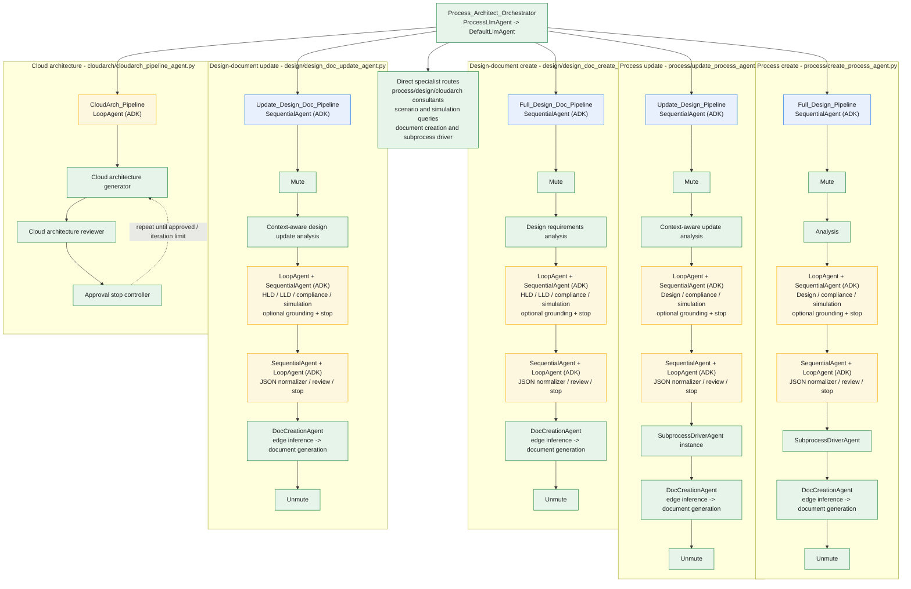

# ADK agent composition

The runtime root is a `ProcessLlmAgent` factory result (`DefaultLlmAgent`,
which derives from ADK `LlmAgent`). Its `sub_agents` are mostly pipeline
objects assembled in the process, design, cloud-architecture, and shared
modules. Blue nodes are external ADK orchestration types; green nodes are
application agents/pipelines; gold nodes are iterative stages.

## Composition notes

- The process and design-document create/update pipelines are
  `SequentialAgent` instances. Each review stage nests a `LoopAgent` around a
  `SequentialAgent`; each normalization stage nests a loop around the
  normalizer, reviewer, and stop agent.
- Grounding is added to the review loops only when
  `enableGroundingAgent` is enabled.
- `DocCreationAgent` owns a `SequentialAgent` with fresh edge-inference and
  document-generation LLM instances. `SubprocessDriverAgent` builds a
  per-step `SequentialAgent` containing a fresh structured-output generator
  and a `SubprocessWriterAgent`.
- Cloud architecture uses a separate `LoopAgent` over generator, reviewer,
  and stop-controller agents.
- `ProcessLlmAgent` and `ProcessAgent` are wrapper factories, not ADK
  orchestrators: they construct `DefaultLlmAgent` and `DefaultAgent`,
  respectively. The wrappers centralize model/configuration behavior and
  accept subagent instances; `SequentialAgent` and `LoopAgent` provide the
  actual pipeline control flow.
