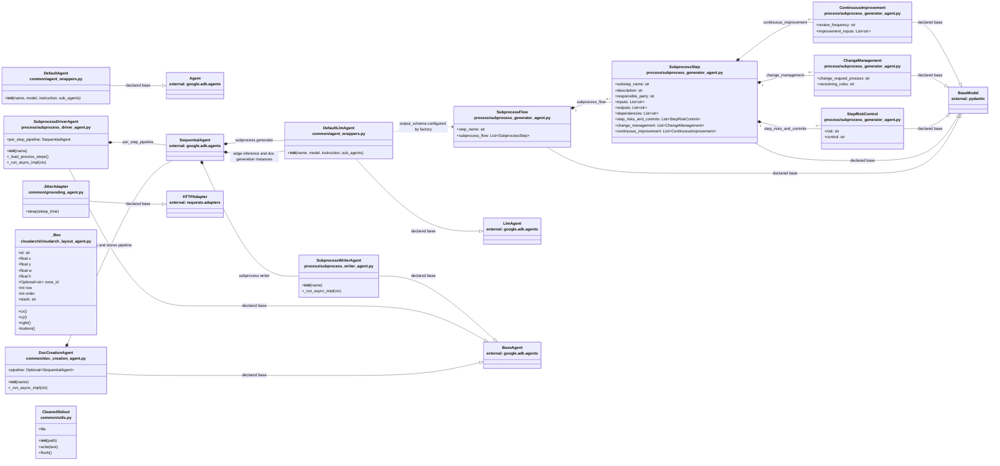

# Application class diagram

This is the application-only class view: it includes all 13 classes declared
under `process_agents/`, with test fixtures and doubles omitted. Members are
selected to make state and responsibilities readable rather than exhaustively
listing every field. Project classes are white; external ADK, Pydantic, and
requests types are gray and labeled with their packages.

Solid inheritance arrows show declared bases. Filled diamonds show
composition established by object construction or typed schema fields.
Dashed arrows show a configuration/runtime dependency rather than ownership.
Labels explain the evidence for each link. Edge-inference and document
generation agents are shown as `DefaultLlmAgent` instances: their source
modules expose agent objects, not Python class declarations.

## Source evidence

| Diagram relationship or members | Source |
|---|---|
| Wrapper bases and constructor configuration | `process_agents/common/agent_wrappers.py:434-612` |
| `DocCreationAgent.pipeline`, sequential construction, and stage factories | `process_agents/common/doc_creation_agent.py:17-72` |
| Driver pipeline field and generator/writer construction | `process_agents/process/subprocess_driver_agent.py:30-55` |
| Writer runtime method | `process_agents/process/subprocess_writer_agent.py:24-35` |
| Schema fields and nested typed lists | `process_agents/process/subprocess_generator_agent.py:19-69` |
| Layout box state and geometry properties | `process_agents/cloudarch/cloudarch_layout_agent.py:149-181` |
| Retry adapter override | `process_agents/common/grounding_agent.py:126-144` |
| File-like output wrapper | `process_agents/common/utils.py:3395-3430` |

The generic composition through ADK `SequentialAgent.sub_agents` reflects the
constructed child instances in `doc_creation_agent.py` and
`subprocess_driver_agent.py`; the ADK orchestration class is external and is
not part of this application's class inventory.
