# Python class hierarchy

This diagram has one node per Python class declaration in the package and
tests. The external nodes are labeled with their owning package; the test
module's `Agent` / `LlmAgent` stubs remain separate from ADK classes. Inheritance
arrows follow declared bases. Composition shown here is backed by typed fields
or constructed `sub_agents` lists.

```mermaid
classDiagram
    direction LR

    class R01["_Box (cloudarch_layout_agent.py:149)"]
    class R02["DefaultLlmAgent (agent_wrappers.py:434)"]
    class R03["DefaultAgent (agent_wrappers.py:531)"]
    class R04["DocCreationAgent (doc_creation_agent.py:48)"]
    class R05["JitterAdapter (grounding_agent.py:126)"]
    class R06["CleanedStdout (utils.py:3395)"]
    class R07["SubprocessDriverAgent (subprocess_driver_agent.py:30)"]
    class R08["StepRiskControl (subprocess_generator_agent.py:19)"]
    class R09["ChangeManagement (subprocess_generator_agent.py:23)"]
    class R10["ContinuousImprovement (subprocess_generator_agent.py:27)"]
    class R11["SubprocessStep (subprocess_generator_agent.py:31)"]
    class R12["SubprocessFlow (subprocess_generator_agent.py:67)"]
    class R13["SubprocessWriterAgent (subprocess_writer_agent.py:24)"]

    class T01["CloneOverrideTests (test_agent_wrappers.py:11)"]
    class T02["RetryHelperTests (test_agent_wrappers.py:25)"]
    class T03["QuotaError (test_agent_wrappers.py:50)"]
    class T04["FakeCacheMetadata (test_agent_wrappers.py:84)"]
    class T05["FakeRequest (test_agent_wrappers.py:91)"]
    class T06["FakeModel (test_agent_wrappers.py:106)"]
    class T07["Model (test_agent_wrappers.py:160)"]
    class T08["AsyncModel (test_agent_wrappers.py:173)"]
    class T09["Model (test_agent_wrappers.py:189)"]
    class T10["AsyncModel (test_agent_wrappers.py:193)"]
    class T11["WrapperConfigurationTests (test_agent_wrappers.py:208)"]
    class T12["CloudArchDrawioMcpToolTest (test_cloudarch_drawio_mcp.py:60)"]
    class T13["ComponentHeightTests (test_cloudarch_layout_agent.py:12)"]
    class T14["LayoutOverlapTests (test_cloudarch_layout_agent.py:34)"]
    class T15["EdgeRoutingTests (test_cloudarch_layout_agent.py:101)"]
    class T16["BuildXmlTests (test_cloudarch_layout_agent.py:287)"]
    class T17["ParseDrawioGraphTests (test_cloudarch_simulation_agent.py:46)"]
    class T18["CloudArchSimulationTests (test_cloudarch_simulation_agent.py:73)"]
    class T19["DesignSimulationTests (test_design_simulation_agent.py:35)"]
    class T20["HTTPAdapter stub (test_grounding_agent.py:23)"]
    class T21["SSLError (test_grounding_agent.py:30)"]
    class T22["Retry stub (test_grounding_agent.py:45)"]
    class T23["LlmAgent stub (test_grounding_agent.py:80)"]
    class T24["Agent stub (test_grounding_agent.py:84)"]
    class T25["LiteLlm stub (test_grounding_agent.py:87)"]
    class T26["ToolContext stub (test_grounding_agent.py:91)"]
    class T27["HttpOptions stub (test_grounding_agent.py:94)"]
    class T28["GenerateContentConfig stub (test_grounding_agent.py:98)"]
    class T29["Gemini stub (test_grounding_agent.py:105)"]
    class T30["GroundingValidationTests (test_grounding_agent.py:132)"]
    class T31["DiGraph stub (test_process_graph_helpers.py:14)"]
    class T32["EdgeInferenceHelperTests (test_process_graph_helpers.py:40)"]
    class T33["StepDiagramHelperTests (test_process_graph_helpers.py:78)"]
    class T34["HttpOptions stub (test_simulation_agent.py:40)"]
    class T35["GenerateContentConfig stub (test_simulation_agent.py:44)"]
    class T36["SimulationParsingTests (test_simulation_agent.py:62)"]
    class T37["SimulationCoreTests (test_simulation_agent.py:98)"]
    class T38["LlmRequest stub (test_utils.py:24)"]
    class T39["LlmResponse stub (test_utils.py:27)"]
    class T40["CallbackContext stub (test_utils.py:30)"]
    class T41["ToolContext stub (test_utils.py:33)"]
    class T42["UtilsValidationTests (test_utils.py:125)"]
    class T43["UtilsPersistenceTests (test_utils.py:211)"]
    class T44["SaveDrawioShapeMappingTests (test_utils.py:299)"]
    class T45["UtilsAgentTests (test_utils_agent_and_design_helpers.py:29)"]
    class T46["DesignHelperTests (test_utils_agent_and_design_helpers.py:83)"]
    class T47["FakeDoc (test_utils_agent_and_design_helpers.py:95)"]
    class T48["WebServiceSessionDeleteTest (test_web_service.py:7)"]

    class ADK_LlmAgent["LlmAgent (external: google.adk.agents)"]
    class ADK_Agent["Agent (external: google.adk.agents; alias of LlmAgent)"]
    class ADK_BaseAgent["BaseAgent (external: google.adk.agents)"]
    class ADK_SequentialAgent["SequentialAgent (external: google.adk.agents)"]
    class ADK_LoopAgent["LoopAgent (external: google.adk.agents)"]
    class Pydantic_BaseModel["BaseModel (external: pydantic)"]
    class Requests_HTTPAdapter["HTTPAdapter (external: requests.adapters)"]
    class Unittest_TestCase["TestCase (external: unittest)"]
    class Builtin_Exception["Exception (external: builtins)"]

    R02 --|> ADK_LlmAgent : declared base
    R03 --|> ADK_Agent : declared base
    R04 --|> ADK_BaseAgent : declared base
    R05 --|> Requests_HTTPAdapter : declared base
    R07 --|> ADK_BaseAgent : declared base
    R08 --|> Pydantic_BaseModel : declared base
    R09 --|> Pydantic_BaseModel : declared base
    R10 --|> Pydantic_BaseModel : declared base
    R11 --|> Pydantic_BaseModel : declared base
    R12 --|> Pydantic_BaseModel : declared base
    R13 --|> ADK_BaseAgent : declared base

    T01 --|> Unittest_TestCase
    T02 --|> Unittest_TestCase
    T03 --|> Builtin_Exception
    T08 --|> T07 : local Model base
    T10 --|> T09 : local Model base
    T11 --|> Unittest_TestCase
    T12 --|> Unittest_TestCase
    T13 --|> Unittest_TestCase
    T14 --|> Unittest_TestCase
    T15 --|> Unittest_TestCase
    T16 --|> Unittest_TestCase
    T17 --|> Unittest_TestCase
    T18 --|> Unittest_TestCase
    T19 --|> Unittest_TestCase
    T21 --|> Builtin_Exception
    T24 --|> T23 : local LlmAgent stub
    T30 --|> Unittest_TestCase
    T32 --|> Unittest_TestCase
    T33 --|> Unittest_TestCase
    T36 --|> Unittest_TestCase
    T37 --|> Unittest_TestCase
    T42 --|> Unittest_TestCase
    T43 --|> Unittest_TestCase
    T44 --|> Unittest_TestCase
    T45 --|> Unittest_TestCase
    T46 --|> Unittest_TestCase
    T48 --|> Unittest_TestCase

    R04 *-- ADK_SequentialAgent : typed pipeline built in constructor
    R07 *-- ADK_SequentialAgent : per_step_pipeline
    ADK_SequentialAgent *-- R02 : generator and document LLM instances
    ADK_SequentialAgent *-- R13 : subprocess writer instance
    R12 *-- R11 : subprocess_flow list
    R11 *-- R08 : step_risks_and_controls list
    R11 *-- R09 : change_management list
    R11 *-- R10 : continuous_improvement list
    ADK_SequentialAgent *-- ADK_BaseAgent : sub_agents
    ADK_LoopAgent *-- ADK_BaseAgent : sub_agents
```

