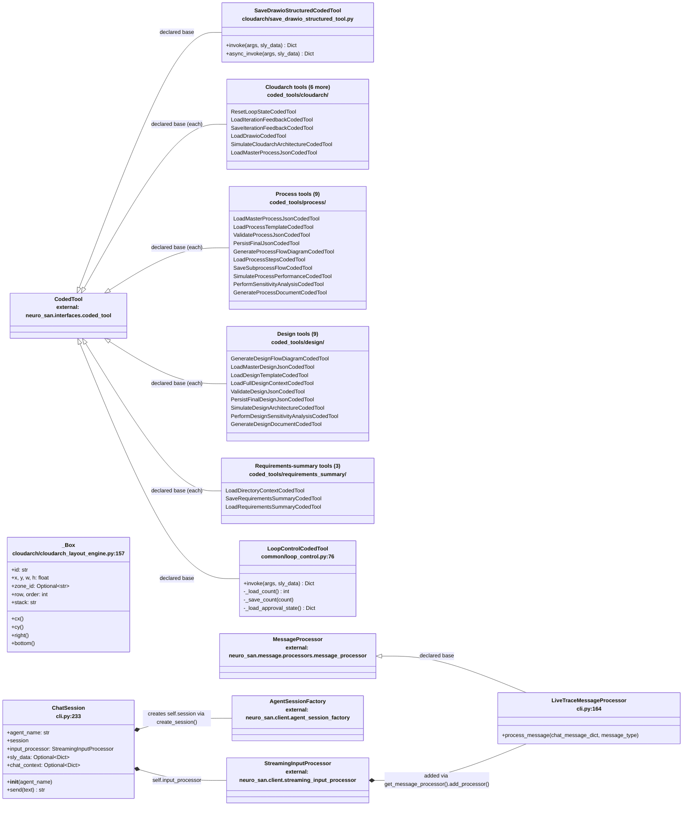

# Application class diagram

This is the application-only view: all 33 classes from
[class-inventory.md](class-inventory.md), test fixtures omitted. Unlike the ADK original's
equivalent diagram (13 classes with a real composition tree -- pydantic schema nesting, ADK
`SequentialAgent` construction), 29 of the 33 classes here are direct, sibling subclasses of the
same external base (`neuro_san.interfaces.coded_tool.CodedTool`) with essentially the same shape:
a `name`/`description` docstring, an `invoke(self, args, sly_data)` method that calls one function
in `coded_tools/common/*.py`, and an `async_invoke` that wraps it via `asyncio.to_thread`. Rather
than repeat that shape 29 times, this diagram shows one representative
(`SaveDrawioStructuredCodedTool`) in full and lists the rest in a single members-free cluster box
per network area; full signatures for every one are in
[class-inventory.md](class-inventory.md).

The four classes with genuinely distinct state or behavior -- `_Box`, `LoopControlCodedTool`,
`LiveTraceMessageProcessor`, and `ChatSession` -- are shown with real members.

## Source evidence

| Diagram relationship or members | Source |
|---|---|
| `SaveDrawioStructuredCodedTool`'s invoke/async_invoke shape (representative of all 29 `CodedTool` leaves) | `coded_tools/cloudarch/save_drawio_structured_tool.py:1-30` |
| `LoopControlCodedTool`'s stop-counter/approval-state reads | `coded_tools/common/loop_control.py:76-115` |
| `_Box`'s fields and geometry properties | `coded_tools/cloudarch/cloudarch_layout_engine.py:157-181` |
| `LiveTraceMessageProcessor`'s base and override | `cli.py:142,164-190` |
| `ChatSession`'s construction and composed objects | `cli.py:233-272` |

The generic `CodedTool <|-- <cluster>` relationships reflect 29 individually-declared classes, not
one collapsed class -- see [class-inventory.md](class-inventory.md) for every one's exact file and
line number.
