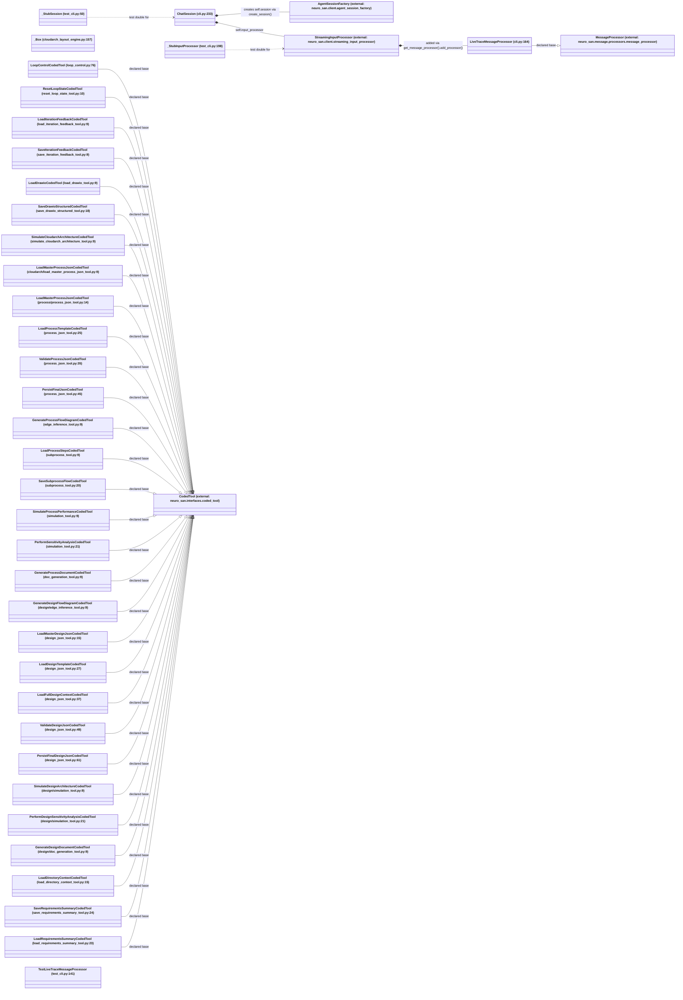

# Python class hierarchy

This diagram has one node per Python class declaration in the package and tests. External nodes
are labeled with their owning package. Inheritance arrows follow declared bases.

Flatter than a typical ADK-style hierarchy by design: neuro-san's `CodedTool` interface is a
single-method entry point (`invoke(args, sly_data)`), not a class hierarchy, so 31 of this
project's 33 application classes are direct, sibling subclasses of the same external base with no
intermediate layers between them -- there's no equivalent of ADK's `DefaultLlmAgent`/`DefaultAgent`
wrapper tier, or its pydantic schema composition tree.

## Notes

- R02 (`_Box`) and R33 (`ChatSession`) are the only two application classes with no declared base.
  `_Box` is a plain internal value object used by `cloudarch_layout_engine.py`'s deterministic
  layout algorithm (position/size of one diagram box); it has no relationship to anything else in
  this inventory.
- R09/R10 share a name but are declared independently in different modules -- see
  [class-inventory.md](class-inventory.md)'s note on why.
- No `@dataclass` declarations or enum subclasses were found under this project's own code (unlike
  the ADK original's pydantic schema cluster, which doesn't exist here -- `CodedTool.invoke()`
  takes/returns plain `Dict[str, Any]`, validated procedurally in `coded_tools/common/process_json.py`
  and `design_json.py` rather than via typed schema classes).
