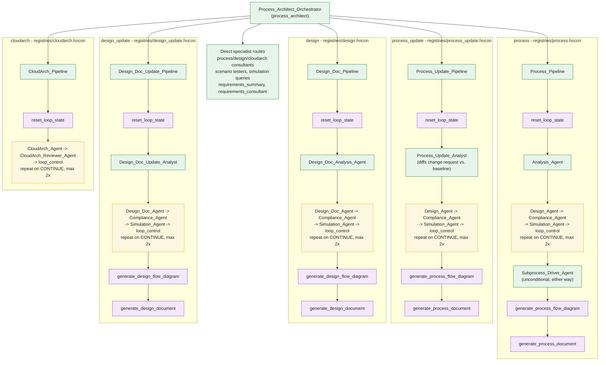

# neuro-san network composition

The runtime root is `process_architect`'s front-man, `Process_Architect_Orchestrator`, which routes
an incoming request to whichever of the other fifteen networks fits it via neuro-san's same-server
external-agent references (`"/network_name"`). Green nodes are LLM-driven agents; gold nodes are
the generate/review loop stage (every pipeline front-man's own instructions implement the same
*reset → generate → review(s) → `loop_control` → continue-or-stop* convention -- there is no
runtime loop primitive the way ADK's `LoopAgent` is); purple nodes are `CodedTool` leaves (no LLM
call).

## Composition notes

- All five pipelines above (`process`, `process_update`, `design`, `design_update`, `cloudarch`)
  share the exact same shape: `reset_loop_state` once, then a generate/review cycle that repeats
  until `loop_control` returns `"STOP"` (either a real approval or the iteration cap), then --
  for the four document-producing pipelines -- an unconditional diagram+document generation stage
  regardless of which way the loop stopped. `process` and `process_update` additionally run
  `Subprocess_Driver_Agent` to (re-)expand every top-level step before documents are generated
  (see [README.md](README.md)'s own note on `process_update` previously lacking this entirely);
  `cloudarch` has no document stage at all (its artifact is the drawio diagram itself, already
  persisted by `CloudArch_Agent`'s own tool calls each round).
- `loop_control` and `reset_loop_state` are the same two `CodedTool` classes
  (`LoopControlCodedTool`/`ResetLoopStateCodedTool`, declared once under `coded_tools/cloudarch/`
  and `coded_tools/common/`) reached through five different networks' own thin re-export modules --
  see [class-inventory.md](class-inventory.md).
- All five pipeline front-men also carry the `pipeline_middleware` summarization middleware (see
  the main README's "NeuroSAN implementation notes") -- not shown above since it doesn't change
  the call sequence, only how much of a long-running front-man's own tool-call history survives
  into its next model call.
- The "Direct specialist routes" node collapses ten simple, loop-free networks that follow one
  shape: a single LLM agent whose own tools are read-only `CodedTool`s (`load_master_process_json`/
  `load_master_design_json`/`load_drawio`, `load_requirements_summary`, and -- for the two
  simulation-query agents -- `simulate_process_performance`/`simulate_design_architecture`/
  `simulate_cloudarch_architecture`). None of them write state back or loop.
- Unlike the ADK original's `SequentialAgent`/`LoopAgent` composition (a real Python object tree
  constructed once at startup), every arrow above is a *convention a front-man's own instructions
  follow*, re-evaluated by the LLM on every turn -- there is no object that enforces the sequence
  at runtime beyond `loop_control`'s own hard iteration-count backstop. See the main README's "Why
  neuro-san needed a different design for the generate/review loop" for the full reasoning.
